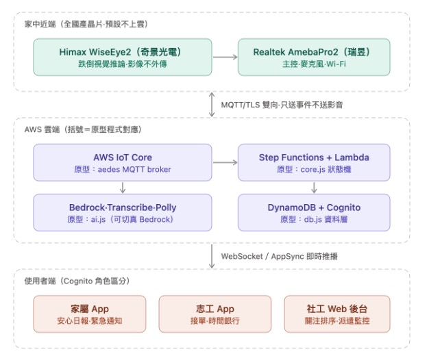
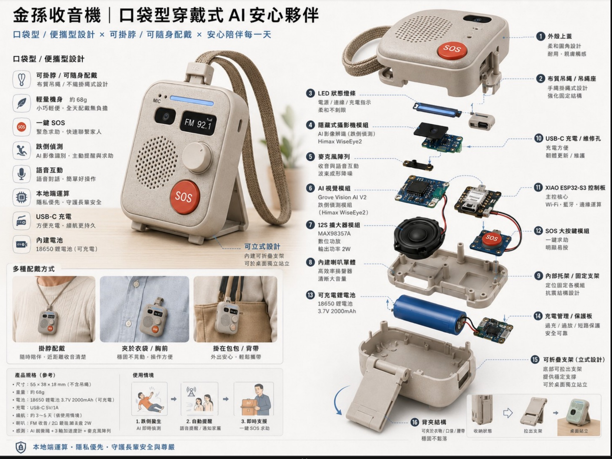
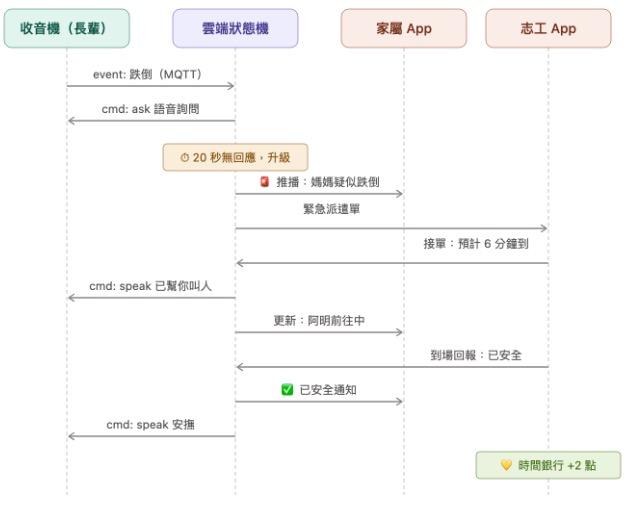

# 系統架構

## 1. 整體架構

家中近端（國產晶片・預設不上雲）→ AWS 雲端（事件觸發才上雲）→ 使用者端（家屬 App／志工 App／社工 Web 後台）。

### 家中近端（全國產晶片・預設不上雲）

> ⚠️ **硬體型態尚未定案**，目前有兩版設計圖並存：
> 1. 上圖：**桌上型收音機**，主控為 Realtek AmebaPro2——**實測韌體已在此版跑通**（HUB8735 Ultra，`firmware/HUB-8735-Ultra-ASR-TTS.ino`：按鈕錄音 → 雲端 ASR → LLM → 雲端 TTS 播放，見 `firmware/README.md`）
> 2. 下圖：**口袋型穿戴式**（掛脖／別胸口／背包夾），主控為 XIAO ESP32-S3，跌倒視覺辨識同樣用 Himax WiseEye2（透過 Grove Vision AI V2 模組）
>
> 
>
> 口袋型版本硬體規格：55×38×18mm（不含吊繩）、約 68g、18650 鋰電池 3.7V 2000mAh（USB-C 充電）、續航約 3–5 天、喇叭輸出 2W、感測為 AI 視覺辨識＋3 軸加速度計＋麥克風陣列。主要模組：LED 狀態燈條、隱藏式攝影機模組（Himax WiseEye2）、麥克風陣列、Grove Vision AI V2、MAX98357A 數位功放、內建喇叭、XIAO ESP32-S3 控制板、SOS 大按鍵模組、可折疊立式支架、背夾結構。
>
> 兩版本在「感知＋決策＋行動」的軟體邏輯上是一致的（見下方），差異只在主控晶片與外型。**目前所有實測都在桌上型（HUB8735 Ultra）上進行**，口袋型僅為設計概念；待定案後，本文件與 `firmware/README.md` 統一改寫，移除另一版描述。

| 元件 | 角色 |
|---|---|
| Himax WiseEye2（奇景光電） | 跌倒視覺推論；影像不外傳，僅本地端運算 |
| Realtek RTL8735B / AmebaPro2（實測板：**HUB8735 Ultra**） | 主控、麥克風收音、Wi-Fi、**BLE 5.1**（家屬 App 藍牙配網）、TTS 發聲 |

> 裝置↔雲端對接（藍牙配網＋上行 `POST /voice`＋下行 MQTT push：裝置訂閱 `jinsun/{serial}/cmd`，server publish 觸發 TTS 發聲；原型 broker 為 server 內嵌 aedes、正式為 AWS IoT Core）見
> [`requirements/hardware-integration.md`](requirements/hardware-integration.md)。RTL8735B 內建 BLE 5.1，
> Ameba Arduino SDK 有現成 `BLEWifiConfig` 服務可供家屬 App 對接。

長輩不需要學習操作任何 App，收音機本身就是完整的互動介面：

- **相機＋ML model**：偵測跌倒／久臥等異常姿態，模型跑在裝置端，畫面不外傳（規劃中，尚未實作）
- **麥克風**：偵測「救命」等關鍵字與異常沉默（關鍵字偵測規劃中；**現況以實體按鈕觸發收音**）
- **語音播報（TTS）**：詢問「你有沒有撞到？」、告知「已經幫你叫人，預計 6 分鐘內到」等安撫與狀態回報
- **SOS 實體按鈕**：一按直接觸發求助流程
- **主動代辦語音**：長輩可直接跟收音機說想要的物資（如「我想買牛奶跟雞蛋」），這段語音才會上傳雲端；其餘時間（吃藥提醒、日常監測）都在本地端處理，長輩不會覺得被監視

隱私設計的關鍵邊界：**影像永不外傳**（跌倒推論在裝置本地完成），語音只有長輩**主動觸發**的段落會上雲做 ASR（對應架構約束 1）。裝置↔雲端只送事件與文字：上行走 HTTPS `POST /voice`，下行**定案走 MQTT push**。實測韌體（`firmware/HUB-8735-Ultra-ASR-TTS.ino`）**上下行都已接上契約**：上行打部署於 Render 的語音 Agent server（`https://jinsun-voice-server-mg1f.onrender.com/voice`），下行以 PubSubClient 訂閱 `jinsun/{serial}/cmd`（QoS 1、LWT 上下線、指數退避重連）。broker 佈署有三種型態：本機開發＝server 內嵌 aedes；**Render 部署＝server 與裝置各自連同一顆外部 broker 會合**（server 設 `MQTT_URL`，因 PaaS 只對外開 HTTPS、內嵌 broker 進不來）；正式＝AWS IoT Core（換 endpoint＋憑證，topic 與 payload 不變）。

### AWS 雲端

> 📐 **完整 AWS 目標架構、服務對應、部署方式與分階段落地計畫**（含 Bedrock / SageMaker AI / Kiro 的具體用途、成本估算、IoT Policy 與 Step Functions 骨架）見
> [`requirements/aws-architecture.md`](requirements/aws-architecture.md)。下表為摘要。
>
> 🟢 **想看「現在實際跑著什麼」**（每個資源都用 `aws` CLI 查證過、哪些線是通的、哪些還沒接）見
> [`requirements/aws-architecture.md` §2.1 現況架構總圖](requirements/aws-architecture.md#21-現況架構總圖2026-08-01-實查)。
> 下表與 §2 目標圖都含尚未建置的服務，**不要當成現況讀**。

括號標註為目前規劃中、尚未實作的原型程式對應（Node.js）：

| AWS 服務 | 用途 | 原型對應 |
|---|---|---|
| AWS IoT Core | 下行指令 push（裝置訂閱 `jinsun/{serial}/cmd`）、接收裝置 MQTT 事件 | aedes MQTT broker（已內嵌於 `cloud/prototype`，見 `src/mqtt.js`） |
| API Gateway + Lambda | 語音文字入口 `POST /voice` | `cloud/prototype/`（已建） |
| LLM（意圖分類／需求解析／陪伴對話） | 語音多 Agent server 的大腦 | `cloud/prototype/`（已建）。**預設走 API key 的 OpenAI 相容閘道**（XCC Gateway，與 ASR 同一把金鑰）；可選 AWS Bedrock 或 mock。供應商由**社工後台即時切換**（Supabase `app_settings.llm_provider`，server 短快取讀取，免重新部署） |
| Step Functions + Lambda | 事件分級、20 秒升級判斷、派遣狀態機 | Emergency Agent 逾時階梯 + 既有 Supabase 狀態機 |
| Aurora Serverless v2（Data API） | 三端與派遣的關聯式資料 | Supabase Postgres（現行）。轉接層 `cloud/prototype/src/db.js` 讓兩套環境跑同一段查詢 |
| API Gateway + `jinsun-data` Lambda | 三端 App 的資料讀寫（取代 PostgREST + Realtime） | Supabase client + Realtime 訂閱。AWS 側改用「變更指紋輪詢」，理由見 [`requirements/aws-architecture.md`](requirements/aws-architecture.md) §4.4 |
| Cognito User Pool（3 個 Group） | 家屬／志工／社工的身分與角色 | Supabase Auth + RLS。RLS 的等價規則重寫在 `cloud/aws/lambda/data/authz.mjs` |
| DynamoDB | Emergency session、長期記憶等 key-value 狀態 | 記憶體 Map + Memory Agent |
| Transcribe（或 OpenAI Whisper） | **家屬↔志工聊天的語音輸入轉文字**（ASR） | Supabase Edge Function `whisper`（已建，`cloud/supabase/functions/whisper`） |
| Amazon SNS Mobile Push / Pinpoint | **背景推播**（App 關閉／在背景時的系統通知） | FCM + APNs（已建）＋ Supabase Database Webhook → Edge Function `send-push`（已建，`cloud/supabase/functions/send-push`） |

**語音多 Agent server（`cloud/prototype/`，設計文件 [`requirements/voice-agent-server.md`](requirements/voice-agent-server.md)，A2A 架構圖／flow／sequence 見 [`requirements/voice-agent-a2a-flow.md`](requirements/voice-agent-a2a-flow.md)）**
是長輩「主動語音互動」的雲端大腦：硬體負責觸發＋收音＋發聲（錄音經雲端 ASR 轉成文字、回覆經雲端 TTS 發聲），文字進 server 後由 Intent / Emergency /
Needs / Conversation / Device / Memory 六個 Agent 分工——閒聊就地回覆，緊急與需求則寫進
`radio_events` / `dispatch_tasks`，接上既有派遣鏈路觸發三端推播。

server 另有一個**進度播報 worker**（`src/progress.js`）：訂閱 Supabase `dispatch_tasks` 的
Realtime 狀態變化，志工「接單(accepted)」「抵達(arrived)」時，反查長輩 `device_serial` 與
`preferred_lang`，透過下行通道主動下發 `speak`（帶 `lang`）→ 收音機念出「志工○○大約○分鐘到，您再等一下喔」。
這補上了「感知→決策→行動→回報」閉環裡長輩端唯一的主動出口。**播報語言（國語／台語）**由家屬在 App
設定（`elders.preferred_lang`），裝置端 TTS 依 `lang` 選語音（正式對應：DynamoDB Streams → Lambda → IoT Core）。

同一個 worker 另訂閱 `volunteers` 的座標變化（志工 App `LocationPublisher` 上報的真實 GPS，
demo 則由 `travel.js` 模擬）：志工走進長輩家 **250 公尺**（`APPROACH_METERS`）內，就先播一句
**「志工○○快到您家門口了，等一下會敲門，是我們派來幫您的」**。理由是長輩獨居、突然被敲門會怕，
`arrived` 那句「到您家門口了，馬上進來看您」是人已在門口才念，對行動慢的長輩太晚。同一張單只預告一次；
若志工一上報就已在到場門檻（60m，與 `isNearbyMeters` 一致）內，則跳過預告、只留「到囉」那句，
避免兩句連珠炮。距離判定在雲端算，志工 App 不必改動上報邏輯。

> **ASR / TTS 位置（依實測韌體修正：都走雲端服務）**。實測韌體（`firmware/HUB-8735-Ultra-ASR-TTS.ino`）
> 由長輩按鈕主動觸發錄音，把**該段音檔**上傳雲端 ASR（faster-whisper Breeze-ASR）轉成文字；TTS 也由
> 雲端服務合成音檔、裝置串流播放。隱私邊界回到約束 1 的原始定義：**只有主動觸發的語音段落上雲，
> 影像永不外傳**；「device-side STT、語音永不上雲」改列為未來隱私強化方向。
> `POST /voice` 契約不變、仍只收文字——裝置先打 ASR 服務拿文字，再把文字送 `/voice`。
> 硬體對接契約見 [`requirements/hardware-integration.md`](requirements/hardware-integration.md)。
> **升級計時器必須放雲端**（Emergency Agent / Step Functions），不可留在 App/裝置，否則關機即失效。

> **聊天語音輸入是另一條線，不受此約束**：家屬／志工在自己的手機 App 上「按住說話」轉文字，
> 是使用者主動對自己的裝置錄音，音檔經 Edge Function `whisper` 代理送 OpenAI Whisper 做 ASR，
> 回傳文字填回輸入框、確認後才以純文字送出（`task_messages`）。這與「長輩端裝置影音永不上雲」
> 的隱私邊界（架構約束 1）互不衝突——邊界管的是**長輩端裝置**，不是 App 使用者主動的語音輸入。
> OpenAI 金鑰只存 Edge Function 的後端 secret（`OPENAI_API_KEY`），永不進前端封包。

雲端狀態機透過 **WebSocket / AppSync** 即時推播通知給三種使用者端，並依 **Cognito** 做角色區分。

**推播是雙軌的**（家屬要收到「疑似跌倒」、志工要收到派遣單，即使 App 沒開著）：
- **前景即時同步**：App 開著時，`SupabaseBackend` 訂閱 Supabase Realtime，事件／派遣單一變化就更新畫面並跳 App 內通知。AWS 平行環境的對應實作是 `AwsBackend`：每 3 秒打一次極輕量的 `/data/version` 取變更指紋，指紋變了才抓快照，且每次寫入後立刻強制刷新（取捨理由見 [`requirements/aws-architecture.md`](requirements/aws-architecture.md) §4.4）。兩者實作同一個 `BackendClient` 介面，由 `JinsunBackends` 依建置參數 `--dart-define=BACKEND` 選用，**UI 完全不知道自己連的是哪一套**。
- **背景系統推播**：App 在背景或關閉時，靠 **FCM（Android）＋ APNs（iOS）** 送系統通知。`radio_events` / `dispatch_tasks` 的 INSERT/UPDATE 觸發 Supabase **Database Webhook** → Edge Function [`send-push`](../cloud/supabase/functions/send-push/index.ts) → 依收件角色／綁定長輩查 `device_tokens` → FCM HTTP v1 發送（現行對應：SNS Mobile Push / Pinpoint）。

App 端由 `jinsun_core` 的 `PushService`（`apps/packages/core`）統一處理：登入後上報 FCM token 到 `device_tokens`、訂閱對應 topic、前景/背景/點擊訊息處理。**推播只承載事件文字，不含原始影音，與隱私邊界（約束 1）一致。** 接入所需的 Firebase／APNs 外部設定與資料流細節見 [`requirements/push-notifications.md`](requirements/push-notifications.md)。

### 使用者端

| 端 | 平台 | 角色 |
|---|---|---|
| 家屬 App | Flutter（Android／iOS） | 安心日報、緊急通知、**藍牙配對收音機（BLE Wi-Fi 佈建）**、**填寫長輩基本資料** |
| 志工 App | Flutter（Android／iOS） | 接單、時間銀行（真實時數）、可服務時段、證件狀態 |
| 社工 Web 後台 | Web（或 App） | 長輩表格（異常置頂）、督導人員、派遣監控、資料匯出 |

**資料模型新增（schema v1.1，見 `cloud/supabase/schema.sql`）**：
- `volunteers` 表補齊（原本 backend 有讀、schema 卻缺）＋ `service_hours`（可服務時段，JSON）。
- `volunteer_certificates` 表：良民證／志工意外險／基礎照護證書的狀態與效期。
- `elders.supervisor_worker_name` / `supervisor_volunteer_name`：每位長輩的督導社工／督導志工。
- 時間銀行時數改由 `time_bank_ledger` 加總（`backend.timeBankMinutesFor(name)`），非本 session 記憶體累加。

**長輩基本資料由家屬填寫（唯一真實來源）**：社工後台的長輩狀態卡、志工派遣單上的姓名／地址／電話／狀況注記，全部來自 `elders` 表，而這張表的內容由**家屬 App**填寫維護（設定頁 → 每台收音機 →「編輯長輩資料」，`ElderProfilePage`）。走 `backend.updateElderProfile()`（`BackendClient` 介面，Supabase／Mock 兩實作），寫 `elders` 後三端 Realtime 即時同步。家屬存檔時對地址做一次**地理編碼（OpenStreetMap Nominatim）**校正 `elders.lat/lng`，讓地圖釘與志工導航路線對到真實住址；查無座標則保留原值、只更新文字欄位。資料未補齊（地址／電話為空）時，設定頁該長輩卡會顯示「待補齊」提醒。

**收音機藍牙配對**：家屬 App 用 BLE（`flutter_blue_plus`）幫新收音機設定 Wi-Fi——搜尋→連線→選 Wi-Fi→傳密碼→裝置上網→以序號綁定。GATT 契約與 status 字串見 [`requirements/hardware-integration.md`](requirements/hardware-integration.md) §2；密碼只經 BLE 直傳、不上雲（不違反隱私邊界）。硬體模擬工具已移出社工後台前台導航（改用 `?sim=1` 進入）。

## 2. 跌倒偵測事件流程（Sequence）

以「疑似跌倒 → 語音確認 → 升級派遣 → 到場回報」為例：

1. 收音機偵測到跌倒事件，透過 MQTT 送出 `event: 跌倒`
2. 雲端狀態機下發 `cmd: ask`，收音機語音詢問長輩狀況
3. **20 秒無回應即升級**：
   - 推播「媽媽疑似跌倒」給家屬 App
   - 送出緊急派遣單給志工 App
4. 志工 App 接單，回報預計到達時間（如 6 分鐘）
5. 雲端狀態機下發 `cmd: speak`，收音機安撫長輩「已經幫你叫人」
6. 志工前往途中，家屬 App 即時收到位置更新
7. 志工到場回報「已安全」→ 雲端狀態機通知家屬「已安全」→ 收音機語音安撫
8. 志工的時間銀行點數 +2

**Bottleneck 提醒**：硬體事件要先穩定傳到雲端（MQTT），且各使用者端（家屬／志工）要能即時收到推播通知，這是整條鏈路能否在黃金時間內完成派遣的關鍵。

**下發指令類型**：原有 `ask`（語音詢問）、`speak`（播報／安撫）之外，語音 Agent server 的 Device Agent
新增裝置控制指令 `volume_up` / `volume_down` / `stop_speak` / `repeat`（對應長輩說「大聲一點／安靜／再說一次」）。

## 3. 角色與軟體類型對照

| 角色 | 需要看到／做到什麼 | 軟體類型 |
|---|---|---|
| 管理介面後台（社工／我們） | 所有即時狀態的 dashboard，需要「下載 Excel」以符合政府申報需求 | Web（或 App 皆可） |
| 家屬 | 掌握老人家即時狀態、接收緊急通知 | Flutter App（跨 Android／iOS，確保推播與易用性） |
| 志工 | 看到老人家需要什麼物資、接單去採買／到場確認安全 | Flutter App |
| 老人家 | 不需要 App，只需要收音機：跌倒偵測相機＋聲音偵測＋語音播報（是否需要幫助／還有多久會到）＋ SOS 時 TTS | 嵌入式裝置（無使用者介面學習成本） |

## 4. 隱私邊界（對應根目錄 README）

裝置端只在偵測到明確事件（SOS、語音求助、疑似跌倒）時才會將資料送上雲端；日常的提醒、關鍵字偵測、跌倒判斷皆在本地端完成，原始影像／聲音不上傳。這個邊界也反映在架構圖上：家中近端與 AWS 雲端之間的界線，是「只送事件不送影音」。
