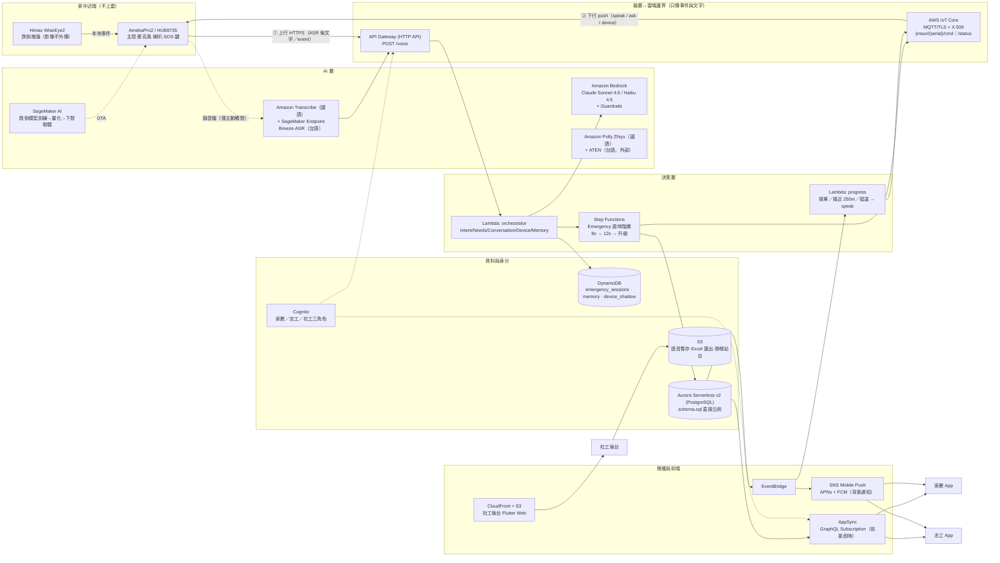
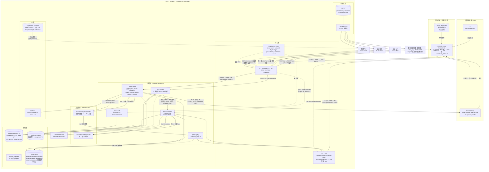
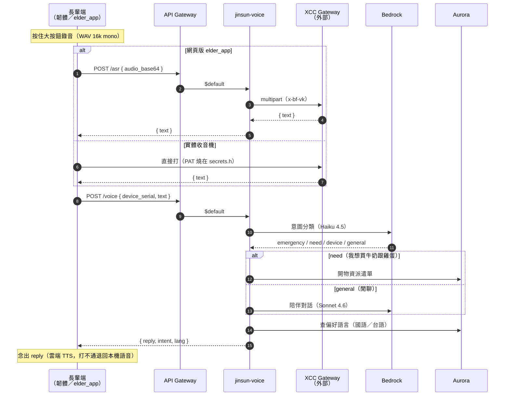
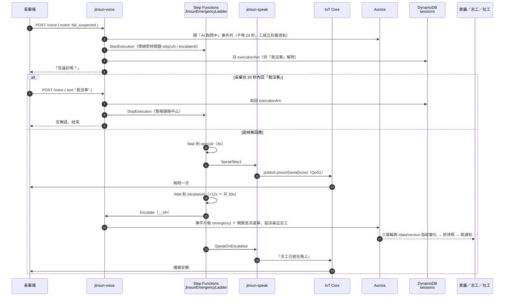
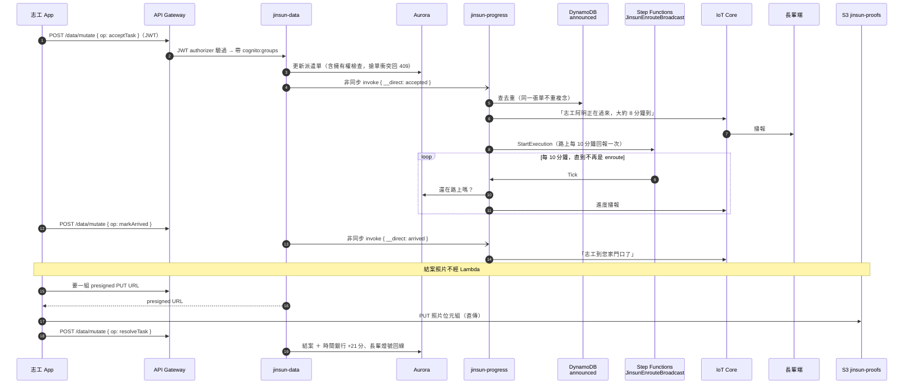
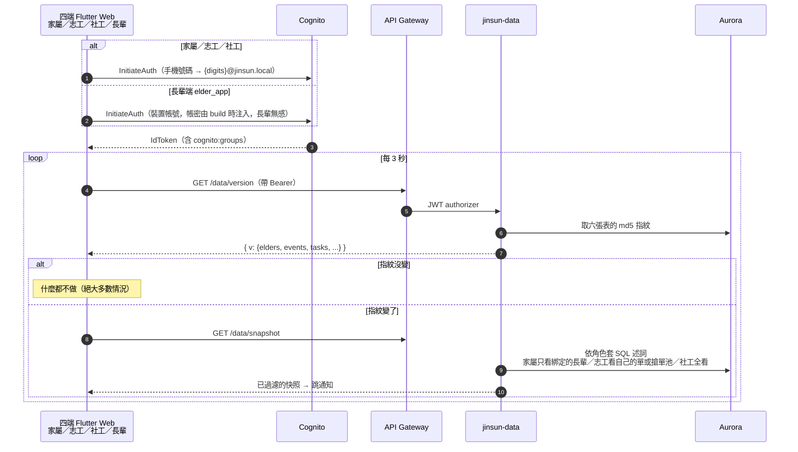

# AWS 架構規劃（2026 AI 創新獎 · AWS 完整開發環境組）

> 對象：使用主辦方提供之 AWS 環境（含 Amazon Bedrock、SageMaker AI、Kiro）。
> 本文是**規劃書**，不是已完成的實作；`docs/architecture.md` 描述的是現況（Supabase + Render + 公共 MQTT broker）。
> 兩者的服務對應在 §3；落地順序在 §7。

---

## 1. 現況盤點（要搬上 AWS 的東西）

| 現況元件 | 位置 | 型態 | 是否有狀態 |
|---|---|---|---|
| `POST /voice` HTTP 入口 | `cloud/prototype/src/server.js` | 常駐 Node HTTP server（Render） | 無 |
| Intent / Needs / Conversation / Device / Memory Agent | `cloud/prototype/src/agents/*` | 純函式 + LLM 呼叫 | 無 |
| **Emergency Agent 逾時階梯（8s → 12s → 升級）** | `cloud/prototype/src/agents/emergency.js` | `setTimeout` 在**行程記憶體**內 | **有（致命）** |
| 下行指令 push | `cloud/prototype/src/mqtt.js` | 內嵌 aedes／外部 mqttgo.io broker | 有（長連線） |
| 進度播報 worker | `cloud/prototype/src/progress.js` | 訂閱 Supabase Realtime 的常駐迴圈 | 有（長連線） |
| 志工移動模擬 | `cloud/prototype/src/travel.js` | 常駐 interval（demo 用） | 有 |
| LLM | `cloud/prototype/src/llm/bedrock.js` | 三供應商可切（apikey / bedrock / mock） | 無 |
| ASR（長輩端錄音） | 韌體直打 XCC Gateway Breeze-ASR | 外部 HTTP | 無 |
| ASR（App 聊天語音） | Supabase Edge Function `whisper` | Deno function | 無 |
| 資料層＋即時同步 | Supabase Postgres + Realtime + RLS | 託管 PG | 有 |
| 背景推播 | Supabase DB Webhook → Edge Function `send-push` → FCM/APNs | Deno function | 無 |
| 三端 UI | Flutter（家屬／志工 App、社工 Web） | 前端 | — |

**搬遷的三個技術難點，決定了整個架構：**

1. **20 秒升級計時器不能待在單一行程**（現在是 `setTimeout`）。行程重啟、擴容、當掉，黃金時間鏈路就斷。→ 必須落到 **Step Functions**。
2. **下行 push 需要裝置常駐連線**，但 PaaS 只開 443（Render 現在靠外部公共 broker 會合，無認證）。→ **IoT Core** 一次解決連線與憑證認證。
3. **資料層被三個 Flutter 端深度使用**（`SupabaseBackend` + Realtime 訂閱）。整包換掉是最大的一筆工。→ 拆成兩條 Track，先搬事件鏈路，資料層另計（§4.2）。

---

## 2. 目標架構總圖

> ⚠️ 這一節是**規劃**，不是現況。圖上的 Transcribe、Polly、AppSync、EventBridge、SNS、Guardrails
> **都還沒建**。要看實際跑著什麼、哪些線是通的，看 [§2.1 現況架構總圖](#21-現況架構總圖2026-08-01-實查)。



**隱私邊界（架構約束 1）在圖上的位置**：`HOME` 與 `EDGE` 之間那條線。跨線的只有**事件與文字**，以及**長輩主動觸發**的那一段錄音（走 ASR）。影像永不跨線。

---

## 2.1 現況架構總圖（2026-08-01 實查）

**這張是實際跑著的東西**，每個節點都用 `aws` CLI 對 account `012804034919` / `us-west-2` 查證過，
不是規劃。與 §2 目標圖的差異列在圖後。



### 用到哪些 AWS 服務、分別用在哪

| AWS 服務 | 實際資源 | 用在什麼地方 |
|---|---|---|
| **API Gateway**（HTTP API） | `jinsun-voice-api` / `yr0ep335el` | 唯一的 HTTPS 入口。8 條路由：`$default`→語音（含 `POST /voice`、`POST /asr`、`GET /health`、`GET /commands`）、`POST /hooks/progress`→進度、`/data/{version,snapshot,mutate,timebank}`→資料 API（掛 JWT authorizer）、`POST /tts`＋`OPTIONS /tts`→國語 TTS（**無 authorizer**，同 `/asr` 的理由）。`/asr` 沒有獨立路由也**沒有 JWT authorizer**——它落在 `$default` 上，長輩端是裝置身分，不該為了轉一句逐字稿去換 token |
| **Lambda** ×6 | `jinsun-voice` `jinsun-data` `jinsun-progress` `jinsun-speak` `jinsun-auth` `jinsun-tts` | 全部商業邏輯。`voice` 跑六個 Agent；`data` 是三端資料 API＋角色授權；`progress` 播報去重；`speak` 只做「publish 一句話到 IoT」；`auth` 是 Cognito 觸發器；`tts` 是國語語音合成（Polly Zhiyu，唯一一支兩套環境共用的） |
| **Step Functions** ×2 | `JinsunEmergencyLadder`、`JinsunEnrouteBroadcast` | **黃金 20 秒鏈路**。取代原本行程內的 `setTimeout`／`setInterval`——行程重啟也不會漏升級。用絕對時間戳而非相對 `Wait`（相對會累積開銷，實測超窗到 21.55s） |
| **IoT Core** | Thing `JS-0001`／`JS-REAL-0001`、policy `JinsunDevicePolicy` | 下行指令 push（`jinsun/{serial}/cmd`）、裝置上下線 LWT。X.509 雙向 TLS，取代正式環境那顆無認證的公共 broker |
| **Aurora Serverless v2** | `jinsun-aurora`、PG 16.14、Data API、0.5–4 ACU | 唯一的關聯式資料庫，與正式環境 Supabase **完全斷開**。走 Data API 所以 Lambda 不必進 VPC。最小容量刻意設 0.5 而非 0（從零擴容約 15 秒，會吃掉黃金窗） |
| **DynamoDB** ×3 | `jinsun_emergency_sessions`、`jinsun_progress_announced`、`jinsun_downlink` | 三張都有 TTL。第一張存急救 session（誰在等回應、Step Functions execution ARN），第二張做播報去重（同一張單不重複念），第三張是**下行扇出佇列**——`jinsun-speak`／`jinsun-progress` publish 到 IoT 的同時複製一份，供瀏覽器版模擬器（`admin/?sim=1`）用 `GET /commands` 長輪詢領取（真裝置不走這條，它收 MQTT push） |
| **Cognito** | User Pool `jinsun-users`、Client `jinsun-apps`、3 個 Group | 三端身分與角色。**角色只認 `cognito:groups`**，不認 `custom:role`（後者使用者自己就能改）。取代 Supabase Auth + RLS。長輩端多一個**裝置帳號** `device-js-0001@jinsun.local`（group `family`，只綁 elder-1）——長輩端沒有 UI，不可能叫長輩登入，帳密在 build 時注入、開網頁自動登入 |
| **Bedrock** | `us.anthropic.claude-sonnet-4-6`、`claude-haiku-4-5` | 六個 Agent 的大腦（意圖分類、需求解析、陪伴對話）。此帳號只授權這兩顆，裸 model id 一律 `ResourceNotFound`，必須帶 `us.` 前綴 |
| **SageMaker** | Endpoint `breeze-asr-26`、`ml.g4dn.xlarge` | 台語 ASR（Transcribe 無台語）。**endpoint 是 InService 的，但還沒接進鏈路**——SageMaker 強制 SigV4 簽章，HUB8735 做不到，要一層 proxy（`cloud/asr-sagemaker/examples/asr-proxy-route.mjs` 是範例） |
| **S3** ×5 | `jinsun-proofs`、`jinsun-{family,volunteer,admin,elder}-web` | 結案照片（presigned PUT，志工直傳不經 Lambda）＋四端 Flutter Web 靜態站 |
| **CloudFront** ×4 | `E2A1BW0EZXSZWA`／`E1SO2GTWWKONH8`／`E4QI5MMFZRZ5A`／`E1QH4VWLX0WN30`（elder） | 四端 HTTPS。**必須用 CloudFront 網址**，S3 網站端點只有 HTTP，瀏覽器在非 HTTPS 下不給定位權限，志工 GPS 上報會整條失效；長輩端更嚴重——麥克風同樣要 HTTPS，走 S3 端點的話大錄音按鈕整個是啞的 |
| **Secrets Manager** | `rds!cluster-b4211a31-…` | Aurora 主密碼，由 RDS 託管（`--manage-master-user-password`），無人經手 |
| **IAM** ×6 role | `JinsunVoice/Progress/Speak/Data/Auth LambdaRole`、`JinsunEmergencyLadderRole` | 每支 Lambda 一個最小權限 role |
| **CloudWatch Logs** | `/aws/lambda/jinsun-*` ×5 | 唯一的除錯入口。⚠️ **retention 未設＝永久保留**，賽後清理要記得 |

### 2.1.1 四條主要流程（服務之間怎麼走）

上面那張圖畫的是「誰連到誰」，這一節畫的是「一次事件依序發生什麼」。四條流程涵蓋
所有服務間的實際呼叫，**沒有出現在這四張圖裡的連線就是還沒接線的**。

#### 流程 A — 長輩主動求助／代辦（唯一會上雲的語音）

長輩端有兩種載體：實體收音機（韌體自己打 XCC）與網頁版 `elder_app`（經 `/asr` 代理，
金鑰不進前端）。上雲的只有「長輩主動按下按鈕」那一段，符合架構約束 1。



#### 流程 B — 疑似跌倒／SOS → 20 秒黃金升級（本系統最重要的一條）

計時器在 Step Functions，不在行程內 —— Lambda 執行完就結束了，`setTimeout` 根本活不到 20 秒。



> ⚠️ `Wait` 用的是**絕對時間戳**（`step1At` / `escalateAt`）而不是相對秒數。相對 `Wait`
> 會把每次狀態轉場的開銷累積進去，實測會超出黃金窗（21.55s）。

#### 流程 C — 志工接單 → 到場 → 結案 → 時間銀行

Aurora 沒有 Realtime，所以「資料庫變更要觸發播報」是靠 `jinsun-data` 寫完之後
**直接非同步 invoke** `jinsun-progress`，不是資料庫觸發器。



#### 流程 D — 四端即時同步與身分（為什麼是輪詢不是訂閱）



> 為什麼不用 AppSync 訂閱：跌倒升級開單是後端 Lambda **直接寫 Aurora** 的，不經過
> AppSync mutation，訂閱對「最重要的那條鏈路」根本不會響。要響就得讓每支後端 Lambda
> 反手再呼叫一次 AppSync，多一層耦合換 3 秒 → 次秒級。這個系統的黃金窗是 20 秒，
> 3 秒的偵測延遲綽綽有餘。詳見 §4.4。

### 與 §2 目標圖的差異（＝還沒做的）

| 目標圖上有 | 現況 |
|---|---|
| Transcribe（國語 ASR） | **沒用**。國語 ASR 走外部 XCC Gateway：韌體直接打，長輩端網頁版則經 `jinsun-voice` 的 `POST /asr` 代理（金鑰不進前端封包）。刻意不換 Transcribe——它沒有台語，而這條是長輩唯一的輸入方式 |
| Polly（國語 TTS） | ✅ **已接**（`jinsun-tts` Lambda，`POST /tts`，Zhiyu neural → WAV）。台語仍走外部 `kws.oaselab.org`（ATEN 是台語模型，Polly 沒有閩南語音色），裝置端依 `speak.lang` 分流 |
| SageMaker 台語 ASR | endpoint 已 InService，**但未接線**（缺 SigV4 proxy） |
| SageMaker 跌倒模型訓練 → OTA | **沒做**。跌倒視覺推論本身尚未實作 |
| AppSync GraphQL Subscription | **沒建**。改用 `/data/version` 變更指紋輪詢（每 3 秒），取捨理由見 §4.4 |
| EventBridge | **沒建**。播報改由 Step Functions 迴圈驅動 |
| SNS Mobile Push | **沒建**。`device_tokens` 已會寫進 Aurora，發送端還沒接 |
| Bedrock Guardrails | **沒設** |
| 資料庫變更 → 播報 | ✅ **已補上**（2026-08-01）。原本 `POST /hooks/progress` 在 API Gateway 上存在但全 repo 沒有呼叫者，且 `jinsun-progress` 因殘留 `@supabase/supabase-js` import 而**載入即失敗**——整條播報鏈路是死的。現改為 `lambda/data/ops.mjs` 的 `acceptTask`／`markArrived`／`setVolunteerLocation` 寫完 Aurora 後**直接非同步 invoke** `jinsun-progress`（`event.__direct`）。詳見 [handoff §5](aws-handoff.md) |

---

## 3. 服務對應表（現況 → AWS）

### 3.1 事件與語音鏈路

| 現況 | AWS 正式服務 | 遷移成本 | 備註 |
|---|---|---|---|
| `POST /voice`（Render 常駐） | **API Gateway HTTP API + Lambda** | 低 | handler 直接包現有 `orchestrator.handle()`；契約（`device_serial` / `text` / `event` / `reply`）完全不變，韌體只換 `BASE_URL` |
| aedes / mqttgo.io broker | **AWS IoT Core** | 中 | topic `jinsun/{serial}/cmd`、payload 完全不變；改 endpoint + 燒 X.509 憑證。**同時解掉「公共 broker 無認證」的資安洞** |
| 上下線偵測（LWT） | **IoT Core Lifecycle Events** → EventBridge → Lambda | 低 | 免自己維護心跳，後台「裝置離線」直接訂閱 `$aws/events/presence/disconnected/{clientId}` |
| **Emergency 逾時階梯**（`setTimeout`） | **Step Functions（Standard）** | 中 | 見 §4.1，這是本案最關鍵的一塊 |
| `progress.js`（Supabase Realtime worker） | **EventBridge Pipes → Lambda**（來源：Aurora 變更 or DynamoDB Streams） | 中 | 志工接單／接近 250m／抵達 → publish 到 IoT Core |
| `travel.js`（demo 志工移動模擬） | **EventBridge Scheduler + Lambda** | 低 | 每 N 秒觸發一次寫座標，demo 專用 |
| LLM（XCC Gateway） | **Amazon Bedrock**（Claude Sonnet 4.6 / Haiku 4.5，實測可用） | **極低** | `llm/bedrock.js` 已經寫好 provider 切換，改 `LLM_PROVIDER=bedrock` 即可；見 §5.1 |
| ASR（Breeze-ASR via XCC） | **Transcribe（zh-TW）＋ SageMaker Endpoint（台語 Breeze-ASR）** | 中 | 見 §5.2 |
| TTS（ATEN，台語） | **Amazon Polly（國語）＋ ATEN 續留（台語）** | ✅ **已完成** | ATEN 是台語模型且端點不吃 voice 參數，換不了國語 → 補 `jinsun-tts`（Polly Zhiyu）走 `lang=mandarin`。Polly 無閩南語音色，台語沒有理由搬 |
| Edge Function `whisper`（App 聊天語音） | **API Gateway + Lambda → Transcribe** | 低 | 金鑰改用 IAM role，不再需要代理外部 API key |
| Edge Function `send-push` → FCM | **SNS Mobile Push（Platform Application: APNs + FCM）** | 中 | 由 EventBridge 規則觸發 Lambda 決定收件者，再 `sns:Publish` 到 endpoint／topic |

### 3.2 資料、身分、前端

| 現況 | AWS 正式服務 | 遷移成本 | 備註 |
|---|---|---|---|
| Supabase Postgres（`schema.sql` 14 張表 + trigger） | **Aurora Serverless v2 (PostgreSQL 16)** | 中 | `schema.sql` 幾乎可原封執行（`gen_random_uuid()`／`jsonb`／trigger 都相容）；只需拿掉 `auth.users` 外鍵改指 Cognito `sub` |
| Supabase Realtime（三端訂閱） | ~~AppSync~~ → **API Gateway + `jinsun-data` Lambda ＋變更指紋輪詢** | 中 | 已實作。改採輪詢的理由見 §4.4；三端共用 `AwsBackend extends BackendClient` |
| Supabase Auth + RLS | **Cognito User Pool（三個 Group：family / volunteer / worker）** | 中 | 已實作。RLS 改寫成 `cloud/aws/lambda/data/authz.mjs` 的讀取述詞＋寫入白名單 |
| 記憶體 Map（Emergency session、Memory Agent） | **DynamoDB**（`emergency_sessions`、`elder_memory`） | 低 | PK = `elderKey`，Emergency session 加 TTL 自動清 |
| 社工後台 Flutter Web | **S3 + CloudFront（OAC）** | 低 | `flutter build web` → `aws s3 sync` |
| Excel 匯出（政府硬需求） | **Lambda 產 xlsx → S3 → Presigned URL** | 低 | 大量資料改走 **Athena over S3 Parquet**；見 §5.4 |
| 裝置配網後的登錄 | **IoT Core Fleet Provisioning + Lambda pre-provisioning hook** | 中 | 家屬 App BLE 配網 → 裝置憑證自動簽發 → 寫 `elders.device_serial` |

---

## 4. 三個關鍵架構決策

### 4.1 決策一：20 秒升級計時器 → Step Functions（**必做**）

現在的計時器活在 `emergency.js` 的 `setTimeout`。這違反架構約束 3 的精神：**計時器必須存活於任何單一行程的生命週期之外**。

**目標狀態機**（✅ 已實作並實測，見 §11.3）：

```
POST /voice（Lambda）
  ├─ 同步回 reply = EMERGENCY_SCRIPT.onStart  → 裝置立刻播（不經 MQTT）
  ├─ 寫 radio_events(status=attention)        → 三端立刻亮「AI 確認中」
  └─ StartExecution，input 帶「絕對時間戳」：
         step1At    = T0 + 8s
         escalateAt = T0 + 20s     （T0 = 長輩聽到第一句的時刻）

狀態機（StartAt = Wait，不重播 onStart）
  ├─ Wait  → TimestampPath: $.step1At
  ├─ SpeakStep1  (Lambda: jinsun-speak → IoT Publish)  「我沒有聽到您的聲音…」
  ├─ Wait  → TimestampPath: $.escalateAt
  ├─ Escalate (Lambda)  寫 dispatch_tasks(kind=emergency) → 觸發三端推播，回傳 etaMinutes
  └─ SpeakOnEscalated (Lambda: jinsun-speak) 「志工已在路上，大約 N 分鐘到…」
```

**三個實作上必須注意的點（都是實測踩出來的，見 §11.3）：**

1. **`onStart` 不要放進狀態機。** 它是 `POST /voice` 的同步 HTTP 回覆（`emergency.js` 就是這樣寫的：
   `return { reply }` 之後才 `armLadder()`）。狀態機若再播一次會重複，且把整條鏈路往後推 2 秒。
   狀態機的 `StartAt` 直接是第一個 Wait。

2. **Step Functions 不能直接 publish 到 MQTT。** AWS SDK 整合清單裡有 `iot`（控制面）、
   `iotjobsdataplane`、`ioteventsdata`，**沒有 IoT Data Plane**——`arn:aws:states:::aws-sdk:iotdata:publish`
   會 `SCHEMA_VALIDATION_FAILED`。必須經一支 Lambda（`jinsun-speak`）代打 `IoTDataPlaneClient.publish`。
   這不算繞路：`Escalate` 那步本來就需要 Lambda 寫資料庫。

3. **用絕對時間戳，不要用相對 `Seconds`。** 相對 Wait 會讓每一步的轉場開銷（StartExecution、
   state transition、Lambda invoke）**累積**，實測升級落在 21.55s、**超窗 1.55s**。
   改成 `TimestampPath` 後，各步偏差彼此獨立且有界，升級穩定落在 T0+20.0s。

**解除（長輩說「我沒事」）**：`POST /voice` 的 Lambda 收到解除詞時，用 DynamoDB 存的 `executionArn`
呼叫 `states:StopExecution`。✅ 已實測：execution 轉為 `ABORTED`，後續 25 秒收音機零指令。
不用 task token、不用輪詢，一行 API 就停掉整條升級鏈——比現在的 `clearTimeout` 更可靠（跨行程有效）。

**為什麼是 Standard 不是 Express**：Standard 有完整執行歷史（評審／稽核可看每一階的時間戳，
§11.3 那張表就是直接從 `get-execution-history` 拉出來的），且 20 秒鏈路量極小，
成本可忽略（$0.025 / 1000 state transitions，一天 100 次事件 ≈ $0.02/月）。

### 4.2 決策二：資料層 → 分兩條 Track，不要一次搬

三個 Flutter 端全部建在 `SupabaseBackend` + Realtime 之上。一次換掉是這個專案最大的單一風險。

| 方案 | 工作量 | schema 可攜性 | 評分（AWS 服務串接） | 建議 |
|---|---|---|---|---|
| 留 Supabase | 0 | — | 低 | 只作為 Track A 期間的過渡 |
| **Aurora Serverless v2 + AppSync + Cognito** | 中 | **高**（`schema.sql` 幾乎原封） | 高 | ✅ **推薦** |
| DynamoDB + AppSync + Cognito | 高 | 低（14 張關聯表要重新設計 single-table） | 高 | 規模化後再考慮；hackathon 期間 CP 值低 |

**推薦理由**：`cloud/supabase/schema.sql` 是關聯式設計（外鍵、trigger、enum、`text[]`、`jsonb`），Aurora PostgreSQL 幾乎零改寫；把預算花在 AppSync 訂閱與 Cognito 授權上，而不是重畫資料模型。DynamoDB 只用在**真正 key-value 的三塊**：Emergency session、長輩長期記憶、裝置 shadow。

Aurora Serverless v2 現已支援 **scale-to-zero（min 0 ACU）**，閒置時段不計費，適合 demo 型專案。

### 4.3 決策三：運算層 → App Runner 保底 + Lambda 主線（**兩者並存**）

> ⚠️ **本節的「App Runner 保底」後來被推翻了，別照著做。** 實測 `apprunner:ListServices`
> 在帳號 012804034919 被 **SCP 擋下**（帳號層級政策，不是權限設定），App Runner 在此帳號根本開不起來。
> `deploy/aws/` 的容器部署已改寫成 ECS Fargate + ALB，但**同樣未實跑過**。
> **實際可用的保底是 Render 那台**（`jinsun-voice-server-mg1f.onrender.com`，仍在運行、連正式 Supabase），
> 韌體把 `#define BACKEND_AWS` 改回 `0` 就切回去。詳見 `aws-handoff.md` §6.3／§6.4。
> 以下保留原始推論以記錄「為什麼主線可以走 Lambda」——那部分的結論仍然成立。

`cloud/prototype/Dockerfile` 已經存在且開頭就寫著「不能放 serverless」。這句話在 IoT Core 之後**部分失效**了：

- 「20 秒計時器」→ 移交 Step Functions ✅
- 「`/commands` 長輪詢」→ demo 模擬器專用，正式鏈路走 IoT Core ✅
- 「進度播報 worker 訂閱 Realtime」→ 移交 EventBridge → Lambda ✅

三個「必須常駐」的理由都被拆掉了，所以主線可以走 Lambda。

**但仍建議同時保留 App Runner**：

| 用途 | 服務 | 理由 |
|---|---|---|
| **主線（評審看的）** | API Gateway + Lambda + Step Functions + IoT Core | 符合「串接多項雲端服務」，且無伺服器維運 |
| **保底（demo 當天的保險）** | **App Runner** 跑現有 `Dockerfile` | 零程式改動、10 分鐘上線；主線出問題時把韌體 `BASE_URL` 切回來即可。它同樣能連 IoT Core（出站 8883 沒問題），所以下行不受影響 |

> App Runner 與 Render 一樣只開對外 443、內嵌 broker 進不來——但改用 IoT Core 後這個限制完全消失，因為裝置是主動連 IoT Core，server 只是另一個 publish 端。**這是搬到 AWS 最直接的一個收益。**

### 4.4 決策四：三端即時同步 → 變更指紋輪詢，**不是** AppSync 訂閱

原規劃是 AppSync GraphQL Subscriptions 對應 `BackendClient` 的 8 個 `Stream`。實作時改掉了，理由有三個，第一個是決定性的：

1. **訂閱對最重要的那條鏈路不會響。** AppSync 的 subscription 只在「經過 AppSync 的 mutation」時觸發。
   但疑似跌倒 20 秒逾時升級、開派遣單，是 Step Functions 叫 `jinsun-voice` Lambda **直接寫 Aurora** 的
   （黃金時間鏈路刻意不繞路）。要讓訂閱響，就得讓每一支後端 Lambda 在寫完資料庫之後，
   反手再呼叫一次 AppSync 的 publish mutation——多一個相依、多一個失敗點，
   而且那個失敗點正好落在系統最不能失敗的地方。
2. **這個系統的即時性標準是 20 秒，不是 200 毫秒。** 黃金窗是「疑似跌倒 → 20 秒無回應 → 升級」，
   3 秒的偵測延遲在其中佔 15%，且**寫入方自己永遠是即時的**（見下）。
   `SupabaseBackend` 本來就有一條 8 秒的保底輪詢在跑，這條路徑是驗證過的。
3. 交接當下 AWS 憑證已過期，AppSync 無法實際部署驗證；一套沒跑過的訂閱鏈路不該進 demo。

**實際做法**（`cloud/aws/lambda/data/index.mjs` + `apps/packages/core/lib/src/aws_backend.dart`）：

| 端點 | 用途 |
|---|---|
| `GET /data/version` | 六張表的變更指紋（每張一個 md5）。App 每 3 秒打一次，**指紋沒變就不抓快照** |
| `GET /data/snapshot` | 一次回全部集合，**單次 Data API 往返**（用 `json_agg` 把六張表包成同一列） |
| `POST /data/mutate` | 具名寫入操作 `{op, args}`，可寫欄位寫死在 `ops.mjs` |

兩個設計細節：

- **指紋不是 `count(*)` + `max(時間)`。** 事件從 `open` 翻成 `escalated`、長輩燈號從 `normal` 翻成
  `emergency`，這兩件事都不新增列、也不動時間欄位——但它們正是最需要立刻反映到三端的變化。
  所以指紋涵蓋「會影響畫面的欄位」本身。
- **每次寫入之後立刻強制抓一次快照。** 所以 3 秒只發生在「別人動的」，
  使用者自己按下去的動作永遠是即時的。

日後若要升級成真訂閱，介面不必動：`AwsBackend` 對外仍是那 8 個 `Stream`，
只要把 `_tick()` 換成訂閱回呼即可。

### 4.5 授權：RLS 的等價規則落在哪裡

原環境的 RLS 其實是 **demo 全開**（`for select using (true)`），不能照搬也不值得照搬。
AWS 這側重寫在 `cloud/aws/lambda/data/authz.mjs`，分兩層：

- **讀**：角色 → SQL 述詞。家屬只看得到 `family_bindings` 綁定的長輩及其事件／派遣單／訊息；
  志工只看得到指派給自己的單，或已開放搶的單（緊急單 pending 即全體可見、物資單要過寬限期、
  追蹤單永不進搶單池）；社工全看。**沒有角色＝什麼都看不到**（預設拒絕）。
- **寫**：op → 允許角色的白名單，再加擁有權檢查（只有接單志工能改 ETA、只能改自己的志工資料、
  看不到的單不能結案）。未知 op 一律拒絕。

兩個刻意的收緊：

- **社工角色不能自助註冊。** `worker` 在授權表裡是「全看、全改」，如果註冊表單自己選就能當社工，
  整套授權等於沒做。`jinsun-auth` 的 PostConfirmation 只接受 `family` / `volunteer`，
  其餘一律退回 `family`；社工由管理者 `admin-add-user-to-group`。
- **時間銀行點數由伺服器算。** 結單點數依 `kind` 與 `eta_minutes` 在 Lambda 內算
  （與 Dart `models.dart` 的 `timeBankMinutes` 同一套算法），不收客戶端送來的數字。

角色一律以 **Cognito Group** 為準（token 的 `cognito:groups`），不看自訂屬性——
自訂屬性使用者自己就能改。

---

## 5. Bedrock / SageMaker AI / Kiro 在本案的具體用途

（此組別的評分重點，每一項都對應到 repo 裡真實存在的需求，不是硬湊）

### 5.1 Amazon Bedrock — 語音多 Agent 的大腦

`cloud/prototype/src/llm/bedrock.js` 已經預留好切換點，落地成本最低。

> ✅ **已在主辦帳號實測（2026-08-01，account `012804034919` / `us-west-2` / `WSParticipantRole`）**。
> 下表的 model id 是**實際打通的**，不是查表推測的。

| 用途 | 模型（實測可用） | 實測延遲 | 對應現有程式 |
|---|---|---|---|
| Intent 分類（快、量大、要便宜） | `us.anthropic.claude-haiku-4-5-20251001-v1:0` | — | `agents/intent.js`（`fast: true` 那條路） |
| 陪伴對話、需求解析 | `us.anthropic.claude-sonnet-4-6` | 2.7–3.2s | `agents/conversation.js`、`agents/needs.js` |

⚠️ **此帳號未授權 Opus 5 / Sonnet 5 / Opus 4.8 / Fable 5**（`AccessDeniedException`）。
本文初稿建議的 `anthropic.claude-opus-5` **不可用**，已改為 Sonnet 4.6。
⚠️ **裸 foundation model id 一律 `ResourceNotFoundException`**（例如 `anthropic.claude-3-haiku-20240307-v1:0`）——
**必須走 inference profile**，也就是帶 `us.` 或 `global.` 前綴的 id。`BEDROCK_MODEL_ID` 請務必填前綴版本。

**實測延遲對黃金窗的意義**：同步回覆 2.7–3.2s，遠小於逾時階梯第一階的 8s，
所以 `/voice` 的 `reply` 走 Bedrock 不會擠壓升級鏈路。Sonnet 4.6 省略 `thinking` 參數即不思考，
這正是 `/voice` 同步回覆要的行為（不要為了品質開 adaptive thinking，那會把延遲推進危險區）。

**實測發現並已修正的兩個 prompt 問題**（切 Bedrock 後才浮現，`agents/conversation.js`
與 `agents/needs.js` 兩支的 system prompt 都已補上，41 個既有測試全數通過）：

1. **長輩稱謂**：Sonnet 4.6 預設會用「阿公／阿嬤」稱呼長輩，違反專案已定案的
   **移除稱謂、一律以「您」相稱**（見 `src/progress.js` 註解）。
2. **表情符號**：模型會在回覆結尾加 emoji（如「…透透氣？😊」）。**這段文字會直接送進 TTS**，
   emoji 念出來是雜音或被跳過。prompt 已明確禁止 emoji／顏文字／Markdown／括號註記，只允許一般標點。

> 切換 LLM 供應商後**務必重跑語氣驗收**——這兩個問題在 XCC Gateway 上不明顯，換 Bedrock 才出現。
> 驗收方式：對最容易誘發的十句（天氣、想念家人、節慶祝賀、身體不適…）打 `/voice`，
> 用 regex 檢查回覆不含 `阿公|阿嬤|爺爺|奶奶|老人家` 與 emoji 碼位。實測 10/10 通過。
| **Bedrock Guardrails** | — | 對長輩的輸出加安全護欄（醫療建議、金融詐騙誘導、自傷內容）——這是「服務對象是失能長者」必須有的一層 |
| **Bedrock Knowledge Bases** | Titan Embeddings + OpenSearch Serverless | 取代 `agents/memory.js` 現在的 regex `deriveMemoryNote()`，做長輩長期記憶的語意檢索（「阿嬤上次提過膝蓋不舒服」） |

**落地設定**（`cloud/prototype/src/llm/bedrock.js` 現有的 env 開關即可，免改程式）：

```bash
LLM_PROVIDER=bedrock
AWS_REGION=us-west-2
BEDROCK_MODEL_ID=us.anthropic.claude-sonnet-4-6                    # 對話／需求解析
BEDROCK_FAST_MODEL_ID=us.anthropic.claude-haiku-4-5-20251001-v1:0  # 意圖分類
```

現有程式用 `AnthropicBedrock`（`@anthropic-ai/bedrock-sdk`，走 `bedrock-runtime` InvokeModel）——
上面兩個 id 已實測可用，**這條路不必改**。若日後要換 Messages-API 端點，
再改用同一套件的 `AnthropicBedrockMantle`（`new AnthropicBedrockMantle({ awsRegion })`），
屆時 model id 改成不帶區域前綴的 `anthropic.` 形式。

**認證：兩種都實測可用**（`AnthropicBedrock` 兩者皆吃）：

| 方式 | 設定 | 適用 |
|---|---|---|
| **Bedrock API key**（推薦給 server） | `AWS_BEARER_TOKEN_BEDROCK=ABSK...` 單一環境變數 | ✅ 本機開發、App Runner、Render——**不需要 IAM role，也不需要 SigV4 憑證輪替**，部署最單純 |
| SigV4（IAM role / 臨時憑證） | `AWS_ACCESS_KEY_ID` / `SECRET` / `SESSION_TOKEN` | Lambda / ECS 等已有 execution role 的環境，直接繼承 role 權限即可 |

> ⚠️ Bedrock API key 有效期有限（long-term key 可設到期日），**放進 Secrets Manager 並記錄到期時間**，
> 別讓它在 demo 當天無聲過期。走 Lambda 時建議改用 execution role，省掉這個維運風險。

> ⚠️ Bedrock **不支援**這些功能，設計時避開：Web search / Web fetch、Code execution、Files API、
> Batches API、Task budgets、Fast mode。本案都用不到。

### 5.2 SageMaker AI — 兩個真實用途

**用途 A：台語 ASR / TTS 端點（`preferred_lang = 'taigi'` 這條路現在完全靠外部服務）**

- Amazon Transcribe 支援 `zh-TW`（國語），**不支援台語**。
- 現用的 `paulpengtw/faster-whisper-Breeze-ASR-26`（台語優化）→ 部署為 **SageMaker Real-time Endpoint**（`ml.g4dn.xlarge`）。
- 路由邏輯：`elders.preferred_lang == 'mandarin'` → Transcribe；`== 'taigi'` → SageMaker endpoint。
- **成本控制**：GPU endpoint 常開約 $0.736/hr ≈ $530/月。Hackathon 期間用 **EventBridge Scheduler 定時起停**（只在開發與 demo 時段開，8h/天 × 14 天 ≈ $82），或改用 **Asynchronous Inference**（無請求時縮到 0 台）。

**用途 B：跌倒偵測模型的訓練與下發（目前 repo 標註「規劃中，尚未實作」）**

```
資料標註 (SageMaker Ground Truth)
  → 訓練 (SageMaker Training Job, PyTorch)
  → 評估 / 版本管理 (SageMaker Model Registry)
  → 量化與編譯 (SageMaker Neo → INT8 TFLite)
  → S3 → IoT Jobs（OTA）→ Himax WiseEye2 裝置端推論
```

**這條 pipeline 完整體現隱私邊界**：訓練用的是**授權過的資料集**，推論在裝置本地跑，**運行時影像永不進雲**。這是簡報上最好講的一頁。

### 5.3 Kiro — spec-driven 開發

本 repo 已使用 Spectra 做 SDD（`openspec/specs`、`openspec/changes`），與 Kiro 的 spec / steering / hooks 概念直接對應：

| Kiro 概念 | 對應本 repo |
|---|---|
| `requirements.md`（EARS 格式需求） | `docs/requirements/*.md` |
| `design.md` | `docs/architecture.md`＋本文件 |
| `tasks.md` | `openspec/changes/<change>/tasks.md` |
| Steering files | `CLAUDE.md`（四條不可違反的架構約束） |
| Agent Hooks | 「改動 `MockBackend` 狀態機必須跑 `apps/packages/core` 的 flutter test」→ 可做成 on-save hook |

**建議在 hackathon 用 Kiro 做的事**：把 §7 Track B（`AwsBackend` 的 Dart 實作 + AppSync schema + CDK stack）交給 Kiro 的 spec 模式產碼——這是三份高度重複、規格明確的樣板程式，最適合 spec-driven 生成，也讓「有用 Kiro」變成可展示的事實而不是口號。

### 5.4 Excel 匯出（架構約束 4，政府硬需求）

| 資料量 | 方案 |
|---|---|
| 小（單月、單區） | Lambda（`exceljs`）直接查 Aurora → 產 xlsx → 寫 S3 → 回傳 presigned URL |
| 大（全縣市、年度申報） | Aurora → **DMS/排程匯出到 S3（Parquet）** → **Athena** 查 → **Step Functions** 組表 → S3 |

兩個方案都必須把匯出檔放進**加 KMS 加密、有 lifecycle policy** 的 S3 bucket；內含長輩姓名、地址、電話，屬個資。

---

## 6. 安全與合規（服務對象是獨居長者，這段不能省）

| 面向 | 做法 |
|---|---|
| 裝置身分 | IoT Core **X.509 per-device 憑證**；IoT Policy 用 `${iot:Connection.Thing.ThingName}` 變數限縮，讓裝置**只能**訂閱／發布自己的 topic。取代目前公共 broker「任何人都能 publish `jinsun/#`」的狀態 |
| 裝置配網 | Fleet Provisioning by Claiming：家屬 App 走 BLE 傳 Wi-Fi，裝置持 claim 憑證換正式憑證，pre-provisioning hook Lambda 同步寫入 `elders.device_serial` |
| 傳輸加密 | 全鏈路 TLS 1.2+（IoT MQTT 8883、API Gateway HTTPS、Aurora `require SSL`） |
| 靜態加密 | Aurora / DynamoDB / S3 全開 KMS CMK；`radio_events.transcript` 與 `task_messages.text` 含個人對話內容 |
| 金鑰管理 | 現有 `SUPABASE_SERVICE_KEY`、`XCC_GATEWAY_PAT`、`FCM_PRIVATE_KEY` → **Secrets Manager**，Lambda 用 IAM role 取，不再進環境變數 |
| 角色權限 | Cognito 三個 Group（family / volunteer / social_worker）；家屬只看得到 `family_bindings` 綁定的長輩；志工只看得到指派給自己或已廣播的派遣單 |
| 稽核 | CloudTrail（全區）＋ Step Functions 執行歷史（每一次升級的完整時間戳，正好是政府稽核要的證據鏈） |
| 隱私邊界（約束 1） | **在 IAM 層強制**：裝置憑證的 IoT Policy 不授予任何 S3/媒體上傳權限；上雲的只有 `POST /voice` 的文字與主動觸發的語音片段 |
| 資料保存 | 語音暫存檔進 S3 後設 **1 天 lifecycle 自動刪除**；ASR 完成即刪 |

---

## 7. 落地計畫（分 Track，可平行）

### Track A — 事件與 AI 鏈路上 AWS（優先，1–2 天）

| # | 工作 | 產出 | 驗收 |
|---|---|---|---|
| A1 | ✅ **Bedrock 開通已驗證** → 切 provider（設 §5.1 那四個 env） | `LLM_PROVIDER=bedrock` 走通 | `curl /health` 回 `llm.provider=bedrock`；`/voice` 意圖分類正確；語氣不出現「阿公／阿嬤」 |
| A2 | ✅ **IoT Core 已建好並驗證**（§11.2）→ 剩「燒進韌體」 | 韌體 `mqtt_server` 改 `a2zyk2buv4tih2-ats.iot.us-west-2.amazonaws.com`、`setRootCA` 換 Amazon Root CA 1、燒入 device 憑證 | 真板子收得到 `speak`（假裝置端已驗證通過） |
| A3 | ✅ **`POST /voice` → API Gateway + Lambda 已完成並實測**（§11.4） | `jinsun-voice` Lambda + HTTP API + DynamoDB session 表 | ✅ 契約 7 項全過；韌體只需把 `BASE_URL` 換成 `https://yr0ep335el.execute-api.us-west-2.amazonaws.com` |
| A4 | ✅ **Emergency 階梯 → Step Functions 已完成並實測**（§11.3） | `JinsunEmergencyLadder` + `jinsun-speak` Lambda | ✅ 升級準時落在 T0+20.0s；說「我沒事」→ `StopExecution` 中止成功 |
| A5 | Transcribe（國語）接上；SageMaker 台語 endpoint 起一台 | ASR 路由 Lambda | `preferred_lang` 兩種都念得出來 |
| A6 | ~~App Runner 保底部署~~ → **此帳號 SCP 擋死，改以 Render 那台為保底**（§4.3 註記） | 備援 URL（Render，已在線） | 韌體 `BACKEND_AWS` 改回 `0` 即切回 |

**Track A 完成後，「感知 → 決策 → 行動」已經全在 AWS 上**，資料層暫時仍指向 Supabase（`dispatch.js` / `progress.js` 只需改連線字串即可切換）。

### Track B — 資料層與三端（加分，2–3 天）

| # | 工作 | 產出 |
|---|---|---|
| B1 | Aurora Serverless v2 建庫，跑 `schema.sql` | PostgreSQL 實例 + seed 資料 |
| B2 | Cognito User Pool + 三個 Group | 對應 `profiles.role` |
| B3 | AppSync GraphQL schema + Subscription（`radio_events`、`dispatch_tasks`、`task_messages`） | schema.graphql + resolver |
| B4 | Dart：`apps/packages/core` 新增 `AwsBackend implements BackendClient` | 與 `SupabaseBackend` 並存，用 flag 切換 |
| B5 | SNS Mobile Push（APNs + FCM Platform Application） | 取代 `send-push` Edge Function |
| B6 | 社工後台 → S3 + CloudFront | Excel 匯出 Lambda |

> **B4 的關鍵前提**：`apps/packages/core/lib/src/backend_client.dart` 已經是介面抽象（`abstract class BackendClient`，`MockBackend` / `SupabaseBackend` 兩個實作並存），所以第三個實作是**新增**而不是改寫。改動 `MockBackend` 狀態機仍必須跑 `apps/packages/core` 的 `flutter test`（黃金時間合約）。

### Track C — 加分項（時間有餘再做）

- SageMaker 跌倒模型 pipeline（訓練 → Neo 量化 → IoT Jobs OTA）
- Bedrock Knowledge Bases 做長輩長期記憶
- Bedrock Guardrails 上線
- Athena + QuickSight：社工後台的統計儀表板

---

## 8. 部署方式建議

### 8.1 IaC：**AWS CDK (TypeScript)**

| 選項 | 評估 |
|---|---|
| **CDK (TypeScript)** | ✅ **推薦**。與 `cloud/prototype` 的 Node 生態一致；IoT Core、Step Functions、AppSync 的 L2 construct 成熟；Kiro 產 CDK 程式碼的效果好 |
| SAM / CloudFormation | 純 Lambda 專案可行，但 IoT Policy + AppSync resolver 用 YAML 寫會很痛苦 |
| Terraform | 團隊無既有 Terraform 資產，hackathon 期間學習成本不划算 |

**目錄放置**（依 repo 放置規則，雲端相關進 `cloud/`）：

```
cloud/
├── prototype/          現有 Node server（保留，作 App Runner 保底與本機開發）
├── infra/              ← 新增：CDK app
│   ├── bin/jinsun.ts
│   └── lib/
│       ├── iot-stack.ts        IoT Core Thing Type / Policy / Fleet Provisioning
│       ├── api-stack.ts        API Gateway + Lambda（/voice、/whisper）
│       ├── emergency-stack.ts  Step Functions 逾時階梯
│       ├── data-stack.ts       Aurora Serverless v2 + DynamoDB + Cognito
│       ├── fanout-stack.ts     EventBridge + SNS Mobile Push + AppSync
│       └── web-stack.ts        S3 + CloudFront（社工後台）
└── supabase/           現有（Track B 完成後標記為 legacy）
```

### 8.2 CI/CD：GitHub Actions + OIDC（免長期金鑰）

```
push to main
  ├─ flutter analyze + flutter test（apps/packages/core 黃金時間合約）
  ├─ node --test（cloud/prototype）
  ├─ cdk diff → 貼回 PR
  └─ cdk deploy（OIDC assume role，不放 AK/SK）
```

### 8.3 環境策略

Hackathon 期間**只開一個 `dev` 環境**（主辦提供的帳號通常單一）。用 CDK context 區分 stack 名稱前綴，保留日後拆 `prod` 的能力，但不要在賽期花時間做多帳號 Organization。

### 8.4 部署順序（相依關係）

```
1. data-stack      (Aurora / DynamoDB / Cognito — 其他 stack 要 export 出來的 ARN)
2. iot-stack       (IoT endpoint — Lambda 要用)
3. api-stack       (Lambda + API Gateway)
4. emergency-stack (Step Functions — 要 api-stack 的 Lambda ARN)
5. fanout-stack    (EventBridge / SNS / AppSync)
6. web-stack       (S3 + CloudFront)
```

---

## 9. 成本估算（Demo 規模：10 台裝置、20 位使用者）

| 服務 | 用量假設 | 月成本（USD） |
|---|---|---|
| IoT Core | 10 裝置常連 + 5 萬則訊息 | < $1 |
| API Gateway HTTP API | 10 萬次請求 | ~$0.10 |
| Lambda | 20 萬次 × 512MB × 500ms | 免費額度內 |
| Step Functions (Standard) | 3000 次事件 × 8 transitions | ~$0.60 |
| **Bedrock** | Haiku 4.5 意圖分類 + Sonnet 4.6 對話，約 5M in / 1M out | **$20–45** |
| **SageMaker（台語 ASR）** | `ml.g4dn.xlarge`，定時起停 8h/天 | **$60–90**（常開則 ~$530） |
| Transcribe（國語） | 500 分鐘 | ~$12 |
| Polly | 20 萬字元 | ~$3 |
| Aurora Serverless v2 | 0.5–2 ACU，開 scale-to-zero | $20–45 |
| DynamoDB | On-demand，低流量 | < $2 |
| AppSync | 50 萬次 query + 訂閱 | ~$3 |
| Cognito | 20 MAU | 免費 |
| SNS Mobile Push | 1 萬則 | 免費額度內 |
| S3 + CloudFront | < 5GB | < $2 |
| **合計** | | **≈ $130–220 / 月** |

**成本控制三招（賽期必做）**：
1. **SageMaker endpoint 定時起停** — 這是最大單一支出，用 EventBridge Scheduler 只在 09:00–18:00 開。
2. **意圖分類用 Haiku 4.5，只有陪伴對話才用 Sonnet 4.6** — 現有 `llm()` 的 `fast` 參數已經做好這個分流，確認 Bedrock 路徑也套用。
3. **Aurora Serverless v2 設 min 0 ACU** — 夜間無流量時歸零。

另設 **AWS Budgets 告警**（$100 / $200 兩道），避免忘了關 GPU endpoint。

---

## 10. 風險與備援

| 風險 | 影響 | 緩解 |
|---|---|---|
| ~~主辦帳號未開通 Bedrock Claude 模型~~ **（已部分發生）** | 最強模型不可用 | ✅ 已實測：Opus 5 / Sonnet 5 / Opus 4.8 全部 `AccessDenied`，**改用 Sonnet 4.6 + Haiku 4.5**（已驗證品質與延遲可接受）。`llm/bedrock.js` 的三段 fallback（bedrock → mock）仍保留為最後防線 |
| SageMaker GPU 配額不足 | 台語 ASR 不可用 | 降級為 Transcribe `zh-TW`（國語）＋ 韌體端 TTS；`preferred_lang` 欄位保留不動 |
| AppSync 訂閱改造來不及 | 三端不即時 | Track A 已獨立可 demo；資料層維持 Supabase，簡報誠實標示「資料層遷移為下一階段」 |
| IoT Core 憑證燒錄失敗（板子無 RTC、Let's Encrypt 90 天短效憑證的既有雷） | 下行不通 | ✅ 已驗證：AWS IoT 用 **Amazon Root CA 1（長效）**，比現在的 Let's Encrypt 情況**明顯更好**，重燒韌體不必再同步更新時鐘到當天；但仍需設一個合理的開機時間 |
| **topic 或 client id 打錯** | 症狀偽裝成「連線不穩」，極難除錯 | ✅ 已實測：IoT Core 對授權失敗是**切斷連線**而非回錯誤碼（§11.2）。除錯 SOP：反覆斷線先查 topic 字串與 client id↔憑證是否匹配，再查網路 |
| Demo 當天主線異常 | 現場開天窗 | ~~App Runner 保底~~（此帳號 SCP 擋死）→ **Render 那台仍在線當保底**，韌體 `#define BACKEND_AWS` 改回 `0` 重燒即切回（§4.3 註記）。⚠️ 切回去等於換一套資料庫，家屬 App 也要一起切 |

---

## 11. 進場檢查清單（拿到 AWS 帳號的前 30 分鐘）

> ✅ 本清單已於 2026-08-01 對主辦帳號跑過一輪，結果見 §11.1。換帳號／換區域時重跑。

```bash
# 1. 確認身分與區域
aws sts get-caller-identity
echo $AWS_REGION

# 2. Bedrock —— ⚠️ list 出來 ≠ 有權呼叫，一定要「試打」才算數
aws bedrock list-foundation-models --query 'modelSummaries[?providerName==`Anthropic`].modelId'
aws bedrock list-inference-profiles \
  --query 'inferenceProfileSummaries[?contains(inferenceProfileId,`anthropic`)].inferenceProfileId'

# 2b. 真正的權限探測（唯一可信的方法）
for M in us.anthropic.claude-opus-5 us.anthropic.claude-sonnet-5 us.anthropic.claude-opus-4-8 \
         us.anthropic.claude-sonnet-4-6 us.anthropic.claude-haiku-4-5-20251001-v1:0 ; do
  aws bedrock-runtime invoke-model --model-id "$M" --cli-binary-format raw-in-base64-out \
    --body '{"anthropic_version":"bedrock-2023-05-31","max_tokens":8,"messages":[{"role":"user","content":"hi"}]}' \
    /dev/null >/dev/null 2>&1 && echo "  ✅ $M" || echo "  ❌ $M"
done

# 3. SageMaker GPU 配額（決定台語 ASR 能不能上）
aws service-quotas list-service-quotas --service-code sagemaker --max-items 100 \
  --query "Quotas[?contains(QuotaName,'g4dn') || contains(QuotaName,'g5')].[QuotaName,Value]" --output table

# 4. IoT Core endpoint（韌體 mqtt_server 要填這個）
aws iot describe-endpoint --endpoint-type iot:Data-ATS

# 5. Aurora Serverless v2 是否可建（部分 workshop 帳號限制 RDS）
aws rds describe-db-engine-versions --engine aurora-postgresql \
  --query 'DBEngineVersions[].EngineVersion' --output text
```

以上結果直接決定 §7 三條 Track 哪些能做、哪些要降級。**先驗證再寫程式。**

### 11.1 實測結果（2026-08-01 · account `012804034919` · `us-west-2`）

| 檢查項 | 結果 | 對計畫的影響 |
|---|---|---|
| 身分 | `arn:aws:sts::012804034919:assumed-role/WSParticipantRole/Participant` | Workshop 參與者角色，建立 IAM role 時可能受限，Track B 前要先試建一個 role |
| **Bedrock 可呼叫模型** | ✅ `us.anthropic.claude-sonnet-4-6`<br>✅ `us.anthropic.claude-haiku-4-5-20251001-v1:0`<br>❌ Opus 5 / Sonnet 5 / Opus 4.8 / Opus 4.7 / Fable 5（`AccessDenied`） | **§5.1 已改寫**。Opus 5 不可用，改用 Sonnet 4.6 |
| ↳ 已排除的可能原因 | 換 **Bedrock API key（`AWS_BEARER_TOKEN_BEDROCK`）**→ 同樣 AccessDenied；換 **us-east-1** → 同樣 AccessDenied | 錯誤訊息為 `is not available for this account`，屬**帳號層級 model entitlement**，非憑證／區域／IAM 問題。唯一解法是請主辦方為 account `012804034919` 開通 model access |
| Bedrock id 形式 | 裸 `anthropic.*` → `ResourceNotFound`；必須帶 `us.` / `global.` 前綴 | `BEDROCK_MODEL_ID` 一定要填 inference profile id |
| Bedrock 實測 | Haiku 正確分類「我想買牛奶跟雞蛋」→ `need`；Sonnet 4.6 對話 2.7–3.2s | ✅ 意圖分流設計成立，延遲遠小於 8s 第一階 |
| **SageMaker GPU 配額** | `ml.g4dn.xlarge` = **2**、`ml.g5.12xlarge` = 1、`ml.g4dn.4xlarge` = 1 | ✅ 台語 Breeze-ASR endpoint 配額足夠（§5.2 用的就是 g4dn.xlarge） |
| IoT Core endpoint | `a2zyk2buv4tih2-ats.iot.us-west-2.amazonaws.com` | 韌體 `mqtt_server` 直接填此值（取代 mqttgo.io） |
| Aurora PostgreSQL | 11.x–14.x 可用；清單未見 15/16 | ⚠️ 建 Serverless v2 前要確認版本；`schema.sql` 語法在 14 應無問題，但要實跑一次 |

**區域是 `us-west-2`**（非原假設的 APAC）。台灣到 us-west-2 約 130–180ms RTT——
對 20 秒黃金窗無影響，但下行 TTS 播報會有可感延遲，demo 時值得先說明。

### 11.2 IoT Core 下行鏈路實測（2026-08-01，已建實體資源）

已在帳號內建立並跑完端對端驗證：

| 資源 | 值 |
|---|---|
| Thing | `JS-REAL-0001`（`arn:aws:iot:us-west-2:012804034919:thing/JS-REAL-0001`） |
| 憑證 | `arn:aws:iot:us-west-2:012804034919:cert/9360515f2ebf…15bf2`（ACTIVE，已綁 thing） |
| Policy | `JinsunDevicePolicy`（內容即 §附錄 B） |
| Endpoint | `a2zyk2buv4tih2-ats.iot.us-west-2.amazonaws.com` |
| Root CA | Amazon Root CA 1（**長效**，取代目前 Let's Encrypt 90 天短效憑證的維運負擔） |

**驗證結果**（用 `mqtt` 套件持憑證扮演裝置，server 端以 `aws iot-data publish` 下發）：

| 項目 | 結果 |
|---|---|
| TLS 8883 + X.509 連線 | ✅ |
| 訂閱 `jinsun/JS-REAL-0001/cmd`（QoS 1） | ✅ 授予 qos=1 |
| server → IoT Core → 裝置 | ✅ payload 與現有契約**一字不差**（`{"commands":[{"type":"speak",…},{"type":"device",…}]}`） |
| **投遞延遲** | **14ms**（IoT Core 內部；不含台灣↔us-west-2 的 RTT） |
| **`cleanSession=false` 離線補投** | ✅ 斷線期間 publish 的 QoS 1 訊息，重連後 `sessionPresent=true` 並確實補投——**與 mqttgo.io 同等，契約要求成立** |
| QoS 1 at-least-once | ✅ 未正確 PUBACK 就斷線 → IoT Core 重送（韌體務必正確回 PUBACK，否則會收到重複指令） |

**⚠️ 對韌體最重要的一個發現：IoT Core 的授權失敗處理方式是「直接切斷連線」，不是回 SUBACK `qos=128`。**

| 越權行為 | IoT Core 反應 |
|---|---|
| 用別台裝置的 client id 連線（憑證不符） | 連線無回應／被拒 |
| 訂閱別台裝置的 `cmd` topic | **整條連線被切斷** |
| publish 到別台裝置的 topic | **整條連線被切斷** |

含意：**topic 打錯一個字，症狀會長得像「連線不穩」而不是「權限錯誤」**。
韌體既有的指數退避重連（1s→2s→…→30s）因此從「nice to have」變成**必要**；
除錯時若看到反覆斷線，第一個要懷疑的是 topic 字串或 client id 與憑證不匹配，而不是網路。

> 🔑 **憑證檔案存放**：私鑰目前只在本 session 的暫存目錄，**session 結束即消失**。
> 要燒進韌體的話請先複製出來妥善保管（**切勿進 git**），或用 `aws iot create-keys-and-certificate` 重簽一組。
>
### 11.3 Emergency 逾時階梯實測（2026-08-01，Track A4 已完成）

已建立並跑通：

| 資源 | 值 |
|---|---|
| Lambda | `jinsun-speak`（`nodejs22.x`，bundle `@aws-sdk/client-iot-data-plane`，2.4MB） |
| Lambda role | `JinsunSpeakLambdaRole`（`iot:Publish` 限縮 `jinsun/*`） |
| 狀態機 | `JinsunEmergencyLadder`（STANDARD） |
| SFN role | `JinsunEmergencyLadderRole`（`lambda:InvokeFunction` 限縮 `jinsun-*`） |

**實測時序**（`get-execution-history`，相對 execution 開始）：

```
T+ 0.00s  ExecutionStarted
T+ 0.02s  Wait（→ step1At）
T+ 7.05s  SpeakStep1        ← 長輩實際聽到：T0+8.67～9.13s
T+ 7.19s  Wait（→ escalateAt）
T+19.24s  Escalate          ← 換算回 T0 正好 20.0s ✅ 守住黃金窗
T+19.24s  SpeakOnEscalated  ← 長輩實際聽到：T0+20.41～20.94s
T+19.41s  ExecutionSucceeded
```

> **「20 秒」量的是升級動作本身，不是長輩聽到安撫語的時刻。**
> `Escalate`（寫 `dispatch_tasks` → 三端推播）準時落在 T0+20.0s；
> 安撫語再晚 0.4–0.9s 才到收音機（Lambda invoke + IoT publish + MQTT 傳遞）。契約要求的是前者。

| 驗收項 | 結果 |
|---|---|
| 兩輪連續測試的升級落點 | 20.41s / 20.94s（含傳遞）— **偏差不累積** |
| 相對 Wait（改版前） | ❌ 21.55s，超窗 1.55s —— 這就是改用絕對時間戳的原因 |
| 解除（`StopExecution`） | ✅ execution → `ABORTED`，後續 25 秒收音機**零指令** |
| payload 契約 | ✅ 與 `hardware-integration.md` §② 一字不差 |

**尚未接上**：`Escalate` 目前是 `Pass` 佔位（回傳固定 `etaMinutes: 8`）。
接資料層時換成 Lambda 寫 `radio_events` / `dispatch_tasks`，狀態機結構不用改。

### 11.4 `POST /voice` → API Gateway + Lambda 實測（2026-08-01，Track A3 已完成）

| 資源 | 值 |
|---|---|
| **BASE_URL** | `https://yr0ep335el.execute-api.us-west-2.amazonaws.com` |
| API Gateway | HTTP API `jinsun-voice-api`（`$default` route → Lambda proxy） |
| Lambda | `jinsun-voice`（`nodejs22.x`、512MB、30s、bundle 15MB） |
| Lambda role | `JinsunVoiceLambdaRole`（SFN／DynamoDB／Bedrock 皆限縮到本案資源） |
| DynamoDB | `jinsun_emergency_sessions`（PK `elderKey`，`expiresAt` TTL 一小時自動清） |

**做法**：直接沿用 `cloud/prototype/src/` 既有的 agents（intent / needs / conversation / device / memory
＋ `config/triggers.js` ＋ `llm/bedrock.js` ＋ `dispatch.js`），**未改動 repo 任何一行**。
Lambda handler 只替換一處——Emergency 的行程內 `setTimeout` 換成 `StartExecution`，
`executionArn` 寫進 DynamoDB 供解除時 `StopExecution`。

**契約驗收**（`hardware-integration.md` §5 的原始 curl，逐條打新 API）：

| # | 請求 | 結果 |
|---|---|---|
| ① | `{"text":"我想買牛奶跟雞蛋"}` | ✅ `intent=need`、`items=["牛奶","雞蛋"]`、`via=rule` |
| ② | `{"text":"我昨天晚上又睡不好"}` | ✅ `intent=general`、`via=llm`（Bedrock） |
| ③ | `{"text":"大聲一點"}` | ✅ `intent=device`、`command=volume_up` |
| ④ | `event=activity_report` | ✅ 200、無 `reply`、不派遣 |
| ⑤ | `event=inactivity_suspected` | ✅ 200、不派志工 |
| ⑥ | 未知 `event` | ✅ 維持 400 |
| ⑦ | 缺 `device_serial` | ✅ 400 |

**緊急鏈路端對端**（`/voice` → Step Functions → IoT Core → 收音機）：

```
T+ 1.07s  HTTP 同步回覆：「我聽到您說「救命」了，我在這裡…」  ← 裝置立刻播，不經 MQTT
T+10.06s  MQTT 下行：「我沒有聽到您的聲音…」
T+21.52s  MQTT 下行：「別擔心，志工已經在路上，大約 8 分鐘到…」
```
> 上表的 T+ 以「測試程式送出 HTTP 前」為基準，含 1.07s 往返。
> 以契約基準（Lambda 設定 T0 的時刻）看，`get-execution-history` 顯示
> **`Escalate` 落在 T0+20.11s**，`escalateAt` input 亦為 `T0+20s` ✅。

**解除鏈路端對端**：喊「救命」→ 5 秒後說「我沒事」→ 回 `emergency_standdown`，
**後續 25 秒零下行指令、無誤派志工** ✅。

**延遲**：rule 快路徑 0.6–1.2s；走 Bedrock 的路徑 4.5–4.8s（含冷啟動）。
緊急觸發走 rule 命中，只花 1.07s——不吃 LLM 延遲，這對黃金窗很重要。

**踩到的坑**：`npm init -y` 產生的 `package.json` 沒有 `"type": "module"`（repo 原始檔有），
Lambda 會把 `.js` 當 CommonJS 而在 init 階段就 `Runtime.UserCodeSyntaxError`。打包腳本要補這個欄位。

**✅ `dispatch` 已轉 live，事件確實落地**：

```
/health → {"ok":true,"llm":"bedrock","dispatch":"live","ladder":true}
radio_events    2026-08-01T04:03:57Z  elder-1  supply_request  open  "我想買醬油跟衛生紙"
dispatch_tasks  2026-08-01T04:00:13Z  elder-1  supply  pending  items=["牛奶","雞蛋"]
```
（第二筆物資單未新增是**正確行為**：`dispatch.js` 有「同長輩已有進行中物資單，不重複開」的去重。）

**接上時踩到的兩個坑：**

1. **`app_settings.llm_provider` 會覆蓋環境變數，且它是所有部署共用的一個值。**
   後台設的是 `apikey`，但 Lambda 沒有 XCC 金鑰 → `currentProvider()` 靜默退回 `mock`，
   長輩收到的是罐頭回覆而且**不易察覺**。改後台設定又會反過來打壞 Render（它沒有 AWS 憑證）。
   → 已在 `llm/bedrock.js` 新增 **`LLM_PROVIDER_FORCE`**：設了就跳過後台查詢，
   讓「這台機器實際做得到什麼」說了算。不設＝維持原本行為，Render 不受影響。
   Lambda 設 `LLM_PROVIDER_FORCE=bedrock`。

2. **`/health` 誤報 `dryrun`。** `dispatch.mode` 是懶惰 getter，`server.js` 靠啟動時的
   `await dispatch.ready()` 觸發探測；Lambda 沒有啟動階段，所以要在 `/health` handler 裡呼叫。

**設定憑證的指令**（值取自 `cloud/prototype/.env`）：

```bash
cd cloud/prototype
SB_URL=$(grep '^SUPABASE_URL=' .env | cut -d= -f2-)
SB_KEY=$(grep '^SUPABASE_SECRET_KEY=' .env | cut -d= -f2-)
aws lambda update-function-configuration --function-name jinsun-voice \
  --environment "Variables={LLM_PROVIDER=bedrock,\
BEDROCK_MODEL_ID=us.anthropic.claude-sonnet-4-6,\
BEDROCK_FAST_MODEL_ID=us.anthropic.claude-haiku-4-5-20251001-v1:0,\
LADDER_ARN=arn:aws:states:us-west-2:012804034919:stateMachine:JinsunEmergencyLadder,\
SESSIONS_TABLE=jinsun_emergency_sessions,\
LLM_PROVIDER_FORCE=bedrock,\
SUPABASE_URL=$SB_URL,SUPABASE_SECRET_KEY=$SB_KEY}"
# 驗證：curl $BASE/health 應回 "dispatch":"live"
```

> ⚠️ 這是**過渡做法**（與現行 Render 部署一致）。secret 進 Lambda 環境變數會出現在
> `get-function-configuration` 的輸出裡，正式版應改用 **Secrets Manager**（見 §6 金鑰管理）。
> `Escalate` 那步目前仍是 `Pass` 佔位，接上後要換成寫 `dispatch_tasks` 的 Lambda。

> 清除這些資源（賽後）：
> ```bash
> aws apigatewayv2 delete-api --api-id yr0ep335el
> aws lambda delete-function --function-name jinsun-voice
> aws dynamodb delete-table --table-name jinsun_emergency_sessions
> aws iam delete-role-policy --role-name JinsunVoiceLambdaRole --policy-name JinsunVoicePerms
> aws iam delete-role --role-name JinsunVoiceLambdaRole
> aws stepfunctions delete-state-machine --state-machine-arn <ladder-arn>
> aws lambda delete-function --function-name jinsun-speak
> aws iam delete-role-policy --role-name JinsunSpeakLambdaRole --policy-name JinsunSpeakPerms
> aws iam delete-role --role-name JinsunSpeakLambdaRole
> aws iam delete-role-policy --role-name JinsunEmergencyLadderRole --policy-name JinsunEmergencyLadderPerms
> aws iam delete-role --role-name JinsunEmergencyLadderRole
> aws iot detach-thing-principal --thing-name JS-REAL-0001 --principal <cert-arn>
> aws iot detach-policy --policy-name JinsunDevicePolicy --target <cert-arn>
> aws iot update-certificate --certificate-id <cert-id> --new-status INACTIVE
> aws iot delete-certificate --certificate-id <cert-id>
> aws iot delete-policy --policy-name JinsunDevicePolicy
> aws iot delete-thing --thing-name JS-REAL-0001
> ```

---

## 附錄 A：Step Functions 狀態機骨架（CDK TypeScript）

> 以下為 §11.3 實測通過的定義，轉寫成 CDK。
> ⚠️ **不要**用 `tasks.CallAwsService({ service: 'iotdata' })`——Step Functions 沒有 IoT Data Plane
> 整合，會 `SCHEMA_VALIDATION_FAILED`（見 §4.1 注意事項 2）。一律經 `jinsun-speak` Lambda。

```ts
// cloud/infra/lib/emergency-stack.ts
import * as sfn from 'aws-cdk-lib/aws-stepfunctions';
import * as tasks from 'aws-cdk-lib/aws-stepfunctions-tasks';

// speak 一律經 Lambda（Step Functions 無法直接 publish 到 MQTT）
const speak = (id: string, textPath: string) =>
  new tasks.LambdaInvoke(this, id, {
    lambdaFunction: speakFn,                       // jinsun-speak → IoTDataPlaneClient.publish
    payload: sfn.TaskInput.fromObject({
      'deviceSerial.$': '$.deviceSerial',
      'text.$': textPath,
      'lang.$': '$.lang',
    }),
    resultPath: sfn.JsonPath.DISCARD,
  });

// ⚠️ 用絕對時間戳，不要用 Duration.seconds()——相對 Wait 會讓轉場開銷累積，實測超窗 1.55s
const definition =
  new sfn.Wait(this, 'WaitStep1', { time: sfn.WaitTime.timestampPath('$.step1At') })
    .next(speak('SpeakStep1', '$.script.step1'))
    .next(new sfn.Wait(this, 'WaitEscalate', { time: sfn.WaitTime.timestampPath('$.escalateAt') }))
    .next(new tasks.LambdaInvoke(this, 'Escalate', {
      lambdaFunction: escalateFn,                  // 寫 dispatch_tasks(kind=emergency) → 三端推播
      resultPath: '$.dispatch',
    }))
    .next(speak('SpeakOnEscalated', '$.dispatch.Payload.etaText'));

new sfn.StateMachine(this, 'EmergencyLadder', {
  stateMachineType: sfn.StateMachineType.STANDARD, // 要完整執行歷史供稽核
  definitionBody: sfn.DefinitionBody.fromChainable(definition),
});
```

**啟動路徑**（在 `/voice` 的 Lambda 內，`onStart` 走同步回覆、不進狀態機）：

```js
const T0 = Date.now();                             // 長輩即將聽到第一句的時刻
const reply = EMERGENCY_SCRIPT.onStart(keyword, { passive });
await sfn.startExecution({ stateMachineArn: LADDER_ARN, input: JSON.stringify({
  deviceSerial, lang,
  step1At:    new Date(T0 +  8_000).toISOString(),  // 絕對時間戳：偏差不累積
  escalateAt: new Date(T0 + 20_000).toISOString(),
  script: { step1: EMERGENCY_SCRIPT.ladder[0].say },
})});
return { reply, intent: 'emergency', action: { type: 'emergency_asking' } };
```

**解除路徑**（同一支 Lambda，後續語句進來時）：

```js
// 長輩說「我沒事」→ 直接停掉整條升級鏈（跨行程有效，取代 clearTimeout）
if (isStanddown(text)) {
  const { executionArn } = await ddb.get({ TableName: SESSIONS, Key: { elderKey } });
  if (executionArn) await sfn.stopExecution({ executionArn, cause: 'elder_standdown' });
}
```

**`jinsun-speak` Lambda**（`nodejs22.x`，需 bundle `@aws-sdk/client-iot-data-plane`）：

```js
import { IoTDataPlaneClient, PublishCommand } from '@aws-sdk/client-iot-data-plane';
const iot = new IoTDataPlaneClient({ endpoint: `https://${process.env.IOT_ENDPOINT}` });

export const handler = async ({ deviceSerial, text, lang = 'mandarin', command }) => {
  const commands = command ? [{ type: 'device', command }] : [{ type: 'speak', text, lang }];
  await iot.send(new PublishCommand({
    topic: `jinsun/${deviceSerial}/cmd`, qos: 1,
    payload: Buffer.from(JSON.stringify({ commands })),   // 形狀同 hardware-integration.md §②
  }));
  return { published: true };
};
```

## 附錄 B：IoT Policy（把隱私邊界寫進 IAM）

```json
{
  "Version": "2012-10-17",
  "Statement": [
    { "Effect": "Allow", "Action": "iot:Connect",
      "Resource": "arn:aws:iot:*:*:client/${iot:Connection.Thing.ThingName}" },
    { "Effect": "Allow", "Action": "iot:Subscribe",
      "Resource": "arn:aws:iot:*:*:topicfilter/jinsun/${iot:Connection.Thing.ThingName}/cmd" },
    { "Effect": "Allow", "Action": "iot:Receive",
      "Resource": "arn:aws:iot:*:*:topic/jinsun/${iot:Connection.Thing.ThingName}/cmd" },
    { "Effect": "Allow", "Action": "iot:Publish",
      "Resource": "arn:aws:iot:*:*:topic/jinsun/${iot:Connection.Thing.ThingName}/status" }
  ]
}
```

裝置**只能**訂閱自己的 `cmd`、只能發布自己的 `status`；沒有任何媒體上傳權限。
架構約束 1（影像永不外傳）因此不只是程式慣例，而是**憑證層強制**的邊界。

---

## 參考

- 現況架構：[`../architecture.md`](../architecture.md)
- 硬體對接契約（topic / payload / 主迴圈）：[`hardware-integration.md`](hardware-integration.md)
- 語音多 Agent server 設計：[`voice-agent-server.md`](voice-agent-server.md)、[`voice-agent-a2a-flow.md`](voice-agent-a2a-flow.md)
- 推播資料流：[`push-notifications.md`](push-notifications.md)
- 資料模型：`cloud/supabase/schema.sql`
