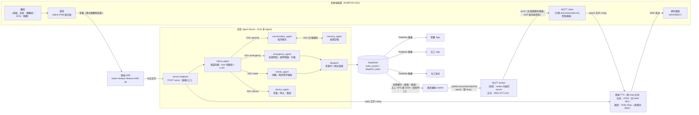
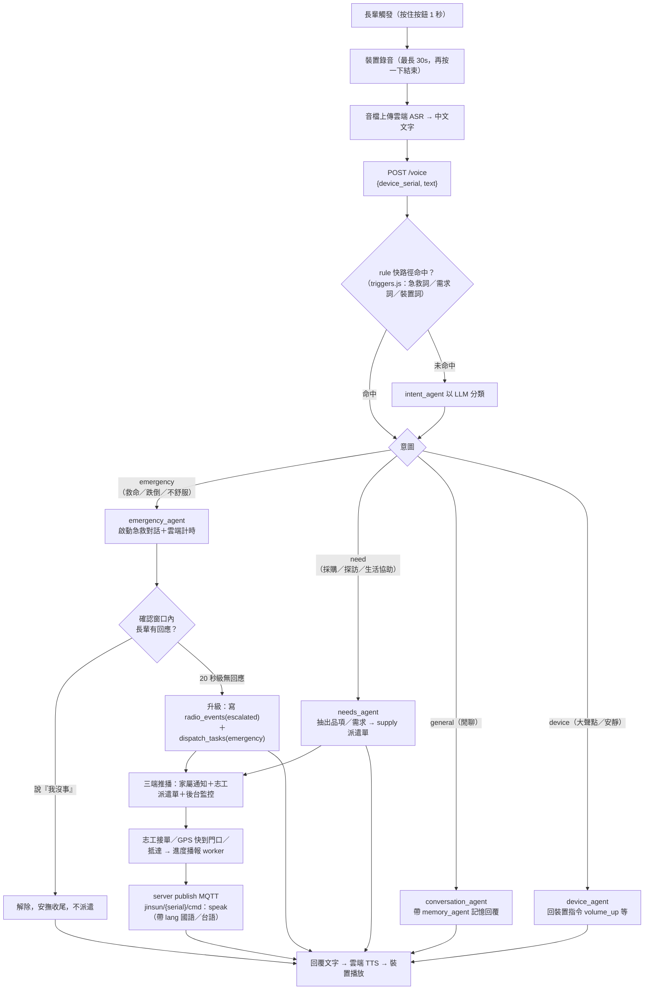
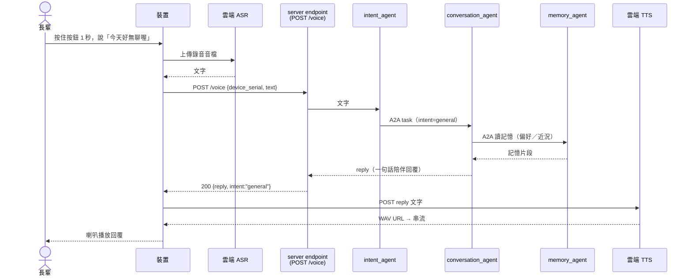
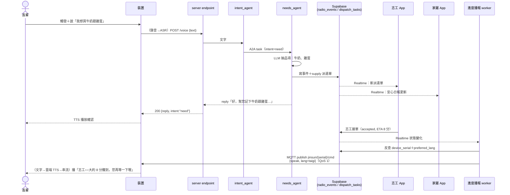
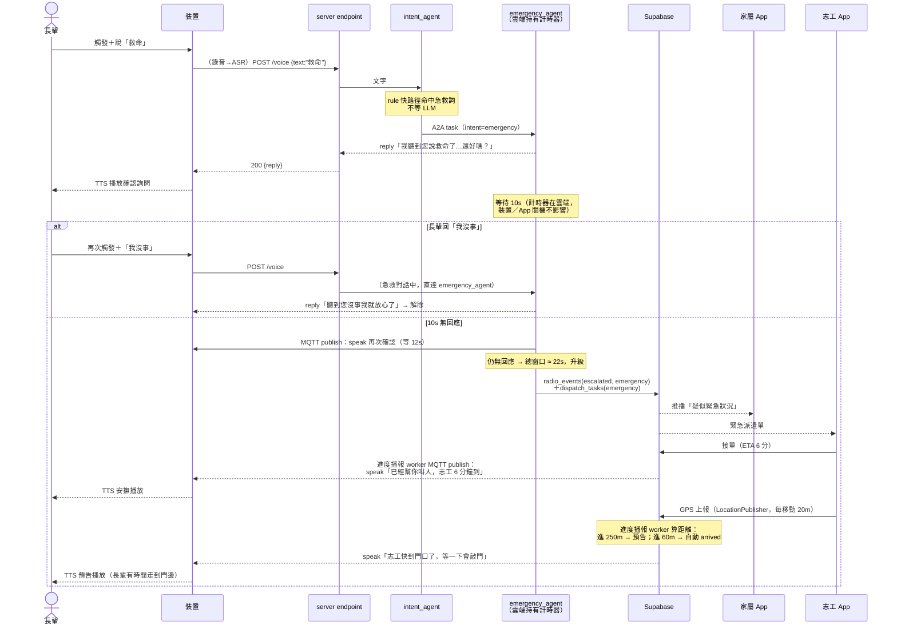

# 語音多 Agent 架構（A2A）：架構圖・Flow・Sequence

> 定位：把 [`voice-agent-server.md`](voice-agent-server.md) 的六 Agent 設計，用 **A2A（Agent-to-Agent）架構**表述成一份可對外說明的規劃：
> **裝置觸發語音 → 雲端 ASR 轉文字 → 文字送 server endpoint（服務唯一入口）→ intent_agent 意圖判斷 → 透過 A2A 把任務轉交專責 agent 執行**。
> 裝置端現況（按鈕觸發、雲端 ASR/TTS）見 [`hardware-integration.md`](hardware-integration.md)；本文圖表以 Mermaid 繪製，GitHub 可直接預覽。

## 1. 端到端架構圖

要點：

- **隱私邊界**（架構約束 1）：只有長輩「主動觸發」那段語音會離開裝置去做 ASR；影像永不外傳。進到 server endpoint 的**只有文字**。
- **server endpoint 是唯一入口**：裝置不直連任何 agent，一律走 `POST /voice`；agent 的增減、拆分對裝置端完全透明。
- **下行是 MQTT push**：裝置開機連上 broker、訂閱 `jinsun/{serial}/cmd` 並保持連線，server 有話要說（急救階梯、進度播報）就 publish，裝置收到即觸發 TTS 發聲。因為是裝置主動向外連線，**家用 NAT 後面也收得到**；連上 broker 即等於註冊，Last Will 順帶給後台「裝置離線」偵測。原型 broker 用 server 內嵌的 aedes，正式換 AWS IoT Core（topic／payload 不變）。
- **雙向都經過雲端 TTS**：即問即答（`reply`）與主動下行（`speak`）最後都變成文字 → TTS → 裝置播放，長輩全程只用耳朵和嘴巴。

## 2. 整體 Flow 圖

## 3. Sequence Diagrams

### 3.1 閒聊（general）——最短路徑，不進派遣

### 3.2 採購／探訪需求（need）——開派遣單、三端推播、進度回報

### 3.3 緊急求救（emergency）——逾時階梯與黃金時間升級

## 4. A2A 溝通規範

每個 agent 以獨立單元看待，intent_agent 是 A2A 的 client、其餘 agent 是 server：

| 元素 | 內容 |
|---|---|
| Agent Card | 每個 agent 宣告 `{name, description, skills[], endpoint}`，intent_agent 依此路由 |
| Task 訊息 | `{task_id, intent, text, device_serial, elder_id, lang, context{急救對話狀態, 記憶}}` |
| 回覆 | `{reply_text, actions[]（開派遣單／裝置指令）, state（如急救對話 lock）}` |
| 狀態鎖 | **急救對話進行中，後續發言一律直達 emergency_agent**（非「我沒事」不解除），不會被誤判成閒聊——對齊 `orchestrator.js` 既有安全預設 |

實作分兩階段：

1. **原型（現況）**：`cloud/prototype/src/orchestrator.js` 以 in-process 呼叫模擬 A2A——訊息格式照上表，但 agent 都在同一個 Node process（可視為 A2A-lite）。
2. **正式**：各 agent 拆成獨立部署單元（Lambda／Bedrock Agents），之間走 A2A 協定（JSON-RPC over HTTP，Agent Card 探索）；intent_agent 保持唯一路由者，server endpoint（API Gateway）保持唯一入口。

## 5. 概念 ↔ 現況對照

| 本文概念 | 原型現況（repo 內） | 正式目標 |
|---|---|---|
| 板子觸發語音 | 按住按鈕 1 秒錄音（`firmware/HUB-8735-Ultra-ASR-TTS.ino`） | ＋喚醒詞「小金孫」／SOS 鍵／相機事件 |
| ASR 語音轉文字 | 雲端 Breeze-ASR-26（已跑通） | 同，服務可抽換 |
| server endpoint | `cloud/prototype` `POST /voice`（已建；**韌體已接上**，原本的直連 Gemini 已移除） | API Gateway + Lambda |
| intent_agent | `agents/intent` ＋ rule 快路徑 `triggers.js` | Bedrock（Claude） |
| A2A 溝通 | in-process orchestrator（A2A-lite） | 獨立部署 + A2A 協定 |
| 各 agent 執行 | emergency／needs／conversation／device／memory 六隻已建 | Step Functions／DynamoDB 等對應見 `voice-agent-server.md` §6 |
| 下行播報 | **已實作：MQTT push**（publish `jinsun/{serial}/cmd`、QoS 1、LWT 上下線；長輪詢保留給瀏覽器模擬控制台）。broker 兩型態：本機＝server 內嵌 aedes（`MQTT_PORT`）；Render 部署＝server 當 client 連外部 broker（`MQTT_URL=mqtts://mqttgo.io:8883`，因 PaaS 只開 443） | AWS IoT Core（換 endpoint＋憑證，topic／payload 不變） |
