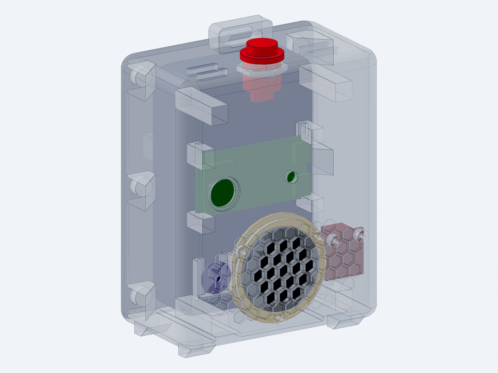

# 長輩端收音機外殼（HUB8735 Ultra smart speaker enclosure）

長輩端裝置的實體外殼：參數化 CAD 原始碼（build123d / Python）＋可直接列印的 STL / 3MF。
韌體在 `firmware/`，硬體與雲端的整合契約在 `docs/requirements/hardware-integration.md`。

外形：直立式圓潤方塊，外徑約 **96 × 115.5 × 56 mm**（W × H × D，含磁吸背板與立架翻片），
單位一律 mm。世界座標：+X 右（正面視角）、+Y 向後、+Z 上；原點 X 置中、Z=0 在外底面、
正面外表面在 Y=−23。



## 檔案結構

```
hardware/enclosure/
├── speaker_design.py                參數與全部零件的 make_*() 幾何（唯一 source of truth）
├── hub8735_speaker_assembly.py      完整標註組裝件（含 mating datums）
├── shell_print.py                   列印件：主殼
├── back_panel_print.py              列印件：磁吸背板
├── speaker_clamp_print.py           列印件：喇叭壓環
├── stand_flap_print.py              列印件：折疊立架／背夾
├── assembly_test.py                 干涉與置入路徑稽核（改版後必跑）
├── *.step                           上列各 .py 產生的 STEP（交付物，進版控）
├── print/                           切片用 STL / 3MF
├── snapshots/                       定版設計截圖
└── reference/speaker-grille.stl     正面蜂巢格柵的造型參考件
```

**只改 `.py`，不要手改 `.step`。** `.step` / `print/*` 都是由 `.py` 產生的輸出。

## 五個列印件

| 檔案 | 說明 | 列印方向 / 材料 |
|---|---|---|
| `shell_print` | 主殼：正面蜂巢格柵、相機窗、喇叭座、麥克風通道、擴大機柱、行動電源導軌、頂部按鈕孔與背帶橋 | 正面朝下貼床（切片前繞 X 轉 −90°），內部特徵全部往上長 |
| `back_panel_print` | 磁吸背板：6 顆磁鐵、4 條對位唇、立架鉸鏈耳座 | 外面朝下貼床（唇朝上） |
| `speaker_clamp_print` | 喇叭壓環，壓住 36 mm 喇叭法蘭 | 平放；3× M2×5 **沉頭**自攻螺絲鎖進殼體柱 |
| `stand_flap_print` | 折疊立架／背夾，鉸接在背板上（Ø3 卡榫扣進耳座），開到 ~35° 讓機身後仰 ~12° | 平放（外面朝下）；**建議 PETG**，夾持需要彈性 |
| `hub8735_speaker_assembly` | 不列印，是驗證與展示用的完整組裝件 | — |

## 內部元件（尺寸皆為實測／查證，非估計）

- **HUB8735 Ultra**：53 × 27 mm PCB、模組厚 8.8 mm。側裝（53 mm 橫置），PCB 平行正面牆，
  鏡頭穿過正面 Ø17 窗。板子由上往下滑入兩支 C 形溝槽塔，**只夾四個短邊角**（長邊有焊排）。
  USB-C 朝 +X，內部留約 28 mm 插頭空間。板背若插排針，與行動電源僅剩約 0.9 mm——
  **杜邦母頭裝不下，要焊線或用直角接頭**。
- **喇叭**：Ø36 ±0.4 / 深 17 ±0.5 / 法蘭 2.7 ±0.3，3 W 4 Ω。淺座環定位 ＋ 壓環固定。
- **麥克風**：INMP441 breakout（**圓形 Ø14**），貼正面牆的 C 形凹槽，Ø3 導音孔穿牆（底進音 MEMS）。
- **擴大機**：GY-MAX98357A（18 × 20，上緣端子台），鎖在兩支 M2 柱上（間距 13 mm，**實板需複驗**），元件面朝後。
- **行動電源**：MD-BP075-Qi，104 × 65 × 19.5 mm、約 200 g、10000 mAh。直立靠背板，
  由地軌＋前擋柱＋磁鐵柱內面定位，拆背板即可更換；底部留充電線槽。
- **按鈕**：16 mm 防水鈕，M16×1.0、body flats 15.0、帽 Ø13、全長 24.8。頂板孔 Ø16.2 帶 15.2 防轉平邊。
- **磁吸背板**：12 顆 Ø8×3 圓磁（殼側 6 顆凹陷 0.8、板側 6 顆凸出 0.8，互相自動對位）。
  **磁鐵要黏牢，且注意極性。**

BOM 五金：3× M2×5 沉頭自攻（喇叭壓環）、2× M2 自攻（擴大機）、12× Ø8×3 圓磁鐵、
16 mm 按鈕 ×1、背帶織帶（頂部 16 × 5 穿帶孔）。

## 幾個不能亂動的設計約束

改幾何前先讀這幾條，都是 `assembly_test.py` 的置入路徑掃掠稽核逼出來的：

1. **只夾三角**：右上角不能有夾塊，否則抽板時卡住 USB-C 凸出。
2. **上排夾塊止於 Z 82.5**：再高則板子由上往下放不進去（頂到天花板）。
3. **左上夾塊內面 −34.6**：讓出相機模組的掃掠通道。
4. **行動電源左上擋點是天花板懸吊的 45° 倒角肋（Y ≥ −4.5）**，不能改成正面牆立柱——會擋住板子的抽出路徑；右上維持立柱。
5. **頂部圓角 ≤ 6**（≥7 會破到內部天花板角落）；喇叭壓環在 X=−22.2 有一段平邊讓開麥克風通道。
6. **格柵底孔要停在凹槽底面下方 ≥1 mm**，否則正面會穿孔。
7. 背板對位唇貼在腔體地板／天花板的 X 34–42.9（貼側牆會撞到後腔圓角）。

**任何佈局改動後都要重跑 `assembly_test.py`。**

## 工具鏈設定

CAD 技能（`cad` / `cad-viewer` / `gcode` 等）已 vendored 在 repo 根目錄的 `.agents/skills/`，
版本鎖在 `skills-lock.json`。Python 環境不進版控，第一次要自己建：

```bash
# 在 repo root
uv venv --python 3.12 .venv          # 或 python3.12 -m venv .venv
.venv/bin/pip install -r .agents/skills/cad/requirements.txt   # cadpy(editable) + playwright
.venv/bin/python -m playwright install chromium --only-shell   # snapshot 需要
```

已驗證版本：Python 3.12、build123d 0.11.1。

## 常用指令

在 `hardware/enclosure/` 底下執行（路徑是相對於 cwd 解析的）：

```bash
R=../..   # repo root

# 由 .py 重新產生 STEP（＋viewer 用的 GLB 快取）
$R/.venv/bin/python $R/.agents/skills/cad/scripts/step shell_print.py
$R/.venv/bin/python $R/.agents/skills/cad/scripts/step hub8735_speaker_assembly.py

# 匯出切片用 mesh
$R/.venv/bin/python $R/.agents/skills/cad/scripts/step shell_print.py --stl print/shell_print.stl

# 幾何檢查
$R/.venv/bin/python $R/.agents/skills/cad/scripts/inspect refs shell_print.step --facts --planes --positioning

# 視覺檢查（--job 批次模式會靜默失敗，一次只跑一個 --input/--output）
$R/.venv/bin/python $R/.agents/skills/cad/scripts/snapshot --input shell_print.step --output snapshots/shell.png

# 干涉／置入路徑稽核
$R/.venv/bin/python assembly_test.py

# 3D viewer（預設 port 4178）
node $R/.agents/skills/cad-viewer/scripts/viewer/backend/server.mjs
```

完整設計歷程與中間迭代截圖留在原始 CAD repo（`../cad`，`hub8735_speaker/`），這裡只保留定版。
